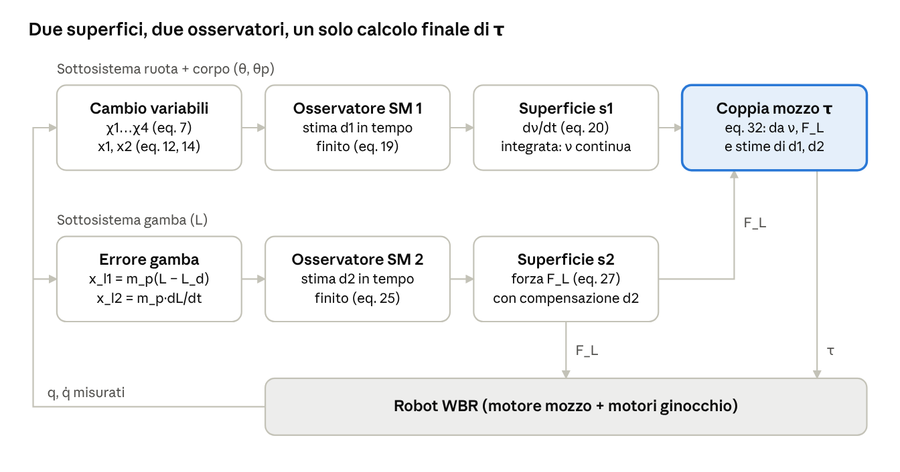
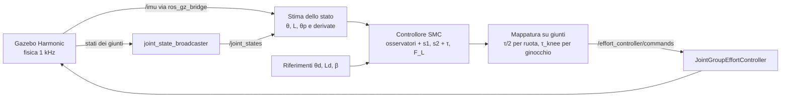

# Controllo robusto sliding mode per un robot bipede a ruote sottoattuato — guida al paper e all'implementazione

*Aggiornato al 28 settembre 2026*

**Paper:** B. Lu, H. Cao, Y. Fang, J. Zhang, Y. Hao, *Robust motion control for an underactuated wheeled bipedal robot utilizing sliding mode strategy*, Control Engineering Practice 153 (2024) 106108, [doi:10.1016/j.conengprac.2024.106108](https://doi.org/10.1016/j.conengprac.2024.106108). Nankai University (Tianjin). Video: [youtu.be/K6T56vM37jA](https://youtu.be/K6T56vM37jA).

## Indice

1. [In breve](#1-in-breve)
2. [Prerequisiti: sliding mode e sistemi sottoattuati](#2-prerequisiti-sliding-mode-e-sistemi-sottoattuati)
3. [Il paper passo per passo](#3-il-paper-passo-per-passo)
4. [Cosa manca nel paper (e come ricavarlo)](#4-cosa-manca-nel-paper-e-come-ricavarlo)
5. [Implementazione in ROS 2 + Gazebo](#5-implementazione-in-ros-2--gazebo)
6. [Limiti del paper](#6-limiti-del-paper)
7. [Glossario](#7-glossario)

---

## 1. In breve

Il paper bilancia un robot bipede a ruote (WBR) che si muove su pendenze e con **gamba a lunghezza variabile**, usando un controllore **sliding mode del secondo ordine a tempo fisso** con **osservatori sliding mode** dei disturbi. Su hardware reale, rispetto a un SMC classico e a un MPC lineare, dimezza l'inclinazione massima del corpo (0,07 contro 0,12–0,13 rad).

La catena logica del paper è:

1. **Modello** planare del WBR: 3 gradi di libertà (θ, L, θp), 2 ingressi (τ, F_L), quindi sottoattuato.
2. **Cambio di variabili** χ1…χ4 che porta la dinamica in una **catena di integratori** (forma a cascata).
3. **Due superfici di scorrimento**: s1 per ruota + corpo, s2 per la gamba.
4. **Due osservatori super-twisting** che stimano i disturbi d1, d2 in tempo finito.
5. **Ingresso virtuale** ν = −λθ̈ la cui *derivata* contiene la commutazione, così i comandi reali τ, F_L sono continui.
6. **Lyapunov**: superfici a zero in tempo fisso, equilibrio asintoticamente stabile (localmente).

---

## 2. Prerequisiti: sliding mode e sistemi sottoattuati

Il paper dà per scontati questi concetti. Senza di essi le equazioni 12–55 sono difficili da seguire.

### 2.1 Sistemi sottoattuati

Un sistema meccanico è **sottoattuato** quando ha meno ingressi indipendenti che gradi di libertà. Non si può imporre una traiettoria arbitraria a tutte le coordinate: alcune si controllano solo *indirettamente*, attraverso l'accoppiamento dinamico con quelle attuate.

Nel WBR: 3 coordinate, 2 ingressi. La coppia τ del motore nel mozzo agisce sulla ruota (+τ) e, per reazione, sul corpo (−τ). Sommando l'equazione della ruota e quella del corpo, τ si cancella e resta un'equazione **senza ingressi** (eq. 6 del paper). È il vincolo che rende difficile il problema: il corpo si raddrizza solo accelerando la ruota, come quando si tiene in equilibrio un bastone sul palmo della mano.

Conseguenze pratiche:

- Non si può applicare la linearizzazione in retroazione completa (servirebbero 3 ingressi).
- Per stare fermo in equilibrio su una pendenza il corpo deve **inclinarsi** di un angolo preciso θpd ≠ 0 (sezione 3.3).
- Una strategia classica è trovare coordinate in cui il sistema diventa una **catena di integratori** e poi usare un progetto ricorsivo (backstepping o, qui, sliding mode). È ciò che fa il paper con le variabili χ.

### 2.2 Sliding mode control: l'idea

Lo SMC lavora in due fasi:

1. **Fase di raggiungimento**: una legge di controllo porta lo stato su una **superficie di scorrimento** s(x) = 0, scelta dal progettista.
2. **Fase di scorrimento**: una volta su s = 0, lo stato vi resta e la dinamica diventa quella, di ordine ridotto, imposta dalla superficie.

Esempio per un doppio integratore disturbato ẍ = u + d con |d| ≤ D:

$$
s = \dot x + c\,x,\qquad c>0
$$

Su s = 0 vale ẋ = −c·x, quindi x → 0 in modo esponenziale **qualunque sia d**. Per arrivarci si impone la **condizione di raggiungimento** (reaching condition):

$$
s\,\dot s \le -\eta\,|s| \quad\Rightarrow\quad u = -c\,\dot x - K\,\mathrm{sgn}(s),\quad K \ge D + \eta
$$

La superficie viene raggiunta in un tempo finito t_r ≤ |s(0)|/η.

Tre proprietà spiegano perché lo SMC piace in robotica:

- **Invarianza** ai disturbi *matched*, cioè quelli che entrano nello stesso canale dell'ingresso: sulla superficie la dinamica non dipende da d.
- **Robustezza** alle incertezze parametriche, che si trattano come disturbi limitati.
- **Convergenza in tempo finito** della superficie.

Il prezzo è il **chattering**, descritto nella sezione 2.4.

**Controllo equivalente.** È l'ingresso continuo u_eq che, sulla superficie, mantiene ṡ = 0. La legge SMC tipica è u = u_eq + termine di raggiungimento. Nel paper la struttura è identica: i termini con h1, f4, ω1 nell'eq. 20 sono la parte "equivalente", quelli con k_s, k_α, k_β sono i termini di raggiungimento.

### 2.3 Disturbi matched e unmatched

- **Matched**: il disturbo entra dove entra l'ingresso, e lo SMC lo rigetta completamente.
- **Unmatched**: il disturbo entra in un canale non attuato, e lo SMC classico da solo non basta.

Nel WBR, d1 compare nell'equazione sottoattuata (6), quindi rispetto al corpo è un disturbo "scomodo". Il paper lo gestisce in due modi: lo include nella catena χ in modo che compaia nell'ultimo stadio (ẋ1 = x2 + d1), e lo **stima con un osservatore** per compensarlo in avanti.

> Nota: l'eq. 1 scrive il disturbo come Sᵀ(u + d), il che metterebbe −d1 anche nell'equazione del corpo. Le equazioni esplicite 3–5 invece mettono d1 **solo** nell'equazione della ruota. Nel resto del paper vale la seconda versione.

### 2.4 Chattering e rimedi

Con sgn(s) l'ingresso commuta tra +K e −K a frequenza teoricamente infinita. Nella realtà, per ritardi, campionamento e dinamiche non modellate degli attuatori, si osserva un'oscillazione ad alta frequenza, il **chattering**, che scalda i motori ed eccita modi elastici.

| Rimedio | Idea | Usato nel paper |
| --- | --- | --- |
| Strato limite | sat(s/Φ) al posto di sgn(s): lineare vicino a s = 0, si perde la convergenza esatta (si converge in una fascia \|s\| ≤ Φ) | sì, negli esperimenti |
| Stima del disturbo | un osservatore stima d e lo compensa, quindi K deve coprire solo l'errore di stima, molto più piccolo di D | sì (eq. 19, 25) |
| SMC di ordine superiore | la commutazione si mette sulla *derivata* dell'ingresso: integrando, l'ingresso è continuo | sì: la legge assegna dν/dt (eq. 20) |
| Super-twisting | algoritmo del secondo ordine con ingresso continuo che porta a zero s e ṡ in tempo finito | sì, come osservatore |

### 2.5 Superfici terminali e terminali non singolari

La superficie lineare s = ẋ + cx dà convergenza **esponenziale** (x → 0 solo per t → ∞). Con esponenti frazionari si ottiene convergenza in **tempo finito** anche sulla superficie:

$$
\text{TSM: } s = \dot x + \beta\, x^{q/p} \qquad\qquad \text{NTSM: } s = x + \frac{1}{\beta}\,\dot x^{\,q/p},\quad 1 < q/p < 2
$$

La TSM ha un problema: derivando s compare x^{q/p − 1}, che va all'infinito per x → 0 se q/p < 1. È la **singolarità**. La **NTSM** (Non-singular Terminal Sliding Mode) mette l'esponente frazionario sulla derivata e usa 1 < q/p < 2, così nella legge di controllo compare ẋ^{q/p − 1} con esponente positivo, che resta finito.

Il paper usa proprio questa forma (eq. 18):

$$
s_1 = (x_2 + \hat d_1)^{q_1/p_1} + a_1 (x_2 + \hat d_1) + c_1 x_1,\qquad p_1 = 9,\; q_1 = 11
$$

Perché **p, q dispari**: x^{11/9} = (x^{11})^{1/9} è la radice nona di un numero, reale anche per x < 0, e conserva il segno. Nel codice va scritto con la funzione "sig":

$$
\mathrm{sig}^{a}(x) = |x|^{a}\,\mathrm{sgn}(x)
$$

Perché ϱ1 ≥ a1 > 0 (così la divisione per ϱ1 nell'eq. 20 è sicura): ϱ1 = a1 + (q1/p1)·(x2 + d̂1)^{(q1−p1)/p1} e (q1 − p1)/p1 = 2/9 ha numeratore **pari**, quindi quel termine è sempre ≥ 0.

### 2.6 Tempo finito e tempo fisso

| Tipo | Condizione di Lyapunov tipica | Tempo di convergenza |
| --- | --- | --- |
| Asintotica/esponenziale | V̇ ≤ −αV | infinito (si tende a 0) |
| Tempo finito | V̇ ≤ −αV^γ, 0 < γ < 1 | T ≤ V(0)^{1−γ} / (α(1−γ)): cresce con lo stato iniziale |
| Tempo fisso | V̇ ≤ −αV^γ − βV^δ, γ < 1 < δ | T ≤ 1/(α(1−γ)) + 1/(β(δ−1)): **indipendente** dallo stato iniziale |

Intuizione: il termine con esponente > 1 domina quando lo stato è lontano e lo riporta vicino in un tempo limitato anche da condizioni iniziali enormi. Il termine con esponente < 1 domina vicino a zero e chiude in tempo finito.

Nel paper i due termini sono k_α·sig^{p1/q1}(s1), con esponente 9/11 < 1, e k_β·sig^{2−p1/q1}(s1), con esponente 13/11 > 1. Con V1 = s1² si ottiene (eq. 36–38):

$$
\dot V_1 \le -\big(k_{\alpha_1} + k_{\beta_1}\Lambda^2\big) V_1^{\frac{p_1+q_1}{2q_1}},\qquad \Lambda = V_1^{\frac{q_1-p_1}{2q_1}}\;\;\Rightarrow\;\; T_1 \le \frac{q_1\pi}{(q_1-p_1)\sqrt{k_{\alpha_1}k_{\beta_1}}}
$$

Con i guadagni del paper: **T1 ≤ 11π / (2·√(10·12)) ≈ 1,58 s** e, per la gamba, **T2 ≤ 11π / (2·√(8·10)) ≈ 1,93 s**. Il paper non riporta questi valori numerici.

Attenzione: il tempo fisso riguarda il raggiungimento delle **superfici**. Lo stato fisico (θ, L, θp) poi converge in modo **asintotico** (quasi-esponenziale) lungo la superficie.

### 2.7 Osservatore super-twisting (differenziatore di Levant)

L'osservatore delle eq. 19 e 25 è il **differenziatore robusto di Levant** (super-twisting), usato per stimare un disturbo. Per un sistema ẋ = u_nom + d, con u_nom noto e |ḋ| ≤ B:

$$
\dot{\hat x} = u_{nom} + \omega_0,\qquad \omega_0 = -\kappa_0 B^{1/2}|\hat x - x|^{1/2}\mathrm{sgn}(\hat x - x) + \hat d,\qquad \dot{\hat d} = \omega_1 = -\kappa_1 B\,\mathrm{sgn}(\hat d - \omega_0)
$$

- x̂ → x e d̂ → d in **tempo finito**.
- ω1 = d̂̇ è una stima della **derivata del disturbo**: per questo compare −ω1 nella legge dell'eq. 20.
- d̂ è l'integrale di un segnale commutante, quindi è **continuo**.
- Valori standard dei guadagni (Levant, 1998): **κ0 = 1,5 e κ1 = 1,1**, con B ≥ max|ḋ|. Il paper non li riporta.

### 2.8 Polinomi di Hurwitz e forma di Jordan (passo 3 della prova)

Sulla superficie s1 = 0 si ha x1 → 0, cioè χ4 = −(ρ1χ1 + ρ2χ2 + ρ3χ3). La dinamica ridotta χ̇ = Aχ + ξ ha A in **forma compagna**, con polinomio caratteristico:

$$
\lambda^3 + \rho_3\lambda^2 + \rho_2\lambda + \rho_1 = (\lambda + k)^3 \;\Leftrightarrow\; \rho_1 = k^3,\; \rho_2 = 3k^2,\; \rho_3 = 3k
$$

Così tutti gli autovalori stanno in −k (Hurwitz). Nel paper k = 3 (ρ1 = ρ2 = 27, ρ3 = 9). L'autovalore triplo rende A **non diagonalizzabile**: la matrice Γ porta A nella forma di Jordan −J, e con V3 = ηᵀη (η = Γ⁻¹χ) si ottiene la stima dell'eq. 50. La condizione k > √2/2 serve a rendere definita positiva Jᵀ + J.

---

## 3. Il paper passo per passo

### 3.1 Robot e variabili

| Simbolo | Significato | Valore sul prototipo |
| --- | --- | --- |
| θ | rotazione **assoluta** della ruota (rad) | — |
| L | distanza centro ruota W – anca H, "lunghezza gamba" (m) | 0,30–0,48 nelle prove |
| θp | inclinazione del segmento WH rispetto alla verticale (rad) | — |
| τ | coppia motore mozzo (totale sulle due ruote) | nominale 2 N·m per motore |
| F_L | forza equivalente lungo WH | prodotta dai motori al ginocchio da 13 N·m |
| β | pendenza del terreno | 0°, ±13°, ±17° |
| φ | angolo interno al ginocchio tra coscia e tibia | — |
| La, Lb | coscia, tibia | 250 mm, 246 mm |
| r, m_w | raggio, massa della ruota | 50 mm, 1,5 kg |
| m_p, J_w, k, φ0 | massa del corpo, inerzia ruota, rigidezza e riposo molla | **non riportati** |

Hardware: 2 motori al ginocchio (13 N·m), 2 motori mozzo (2 N·m), IMU X-sense sul corpo, NVIDIA Jetson NX, bus CAN, **ciclo di controllo 10 ms**, codice C++.

### 3.2 Modello dinamico (eq. 1–6), con la derivazione che il paper omette

Il paper dà le matrici senza derivarle. Si ricostruiscono con Lagrange sotto queste **ipotesi implicite**:

- tutta la massa sopra la ruota è un **punto materiale m_p nell'anca H**: gambe senza massa, inerzia del corpo trascurata;
- **rotolamento puro** su un piano inclinato di β;
- **moto planare**: le due ruote e le due gambe sono una sola ruota e una sola gamba equivalenti (m_w e J_w sono totali).

In un sistema di riferimento con asse x parallelo al pendio, detto ψ = β + θp:

$$
p_W = (r\theta,\; 0),\qquad p_H = (r\theta + L\sin\psi,\; L\cos\psi)
$$

L'energia cinetica è:

$$
T = \tfrac12 (m_w r^2 + J_w)\dot\theta^2 + \tfrac12 m_p\big[r^2\dot\theta^2 + 2r\dot\theta(\dot L\sin\psi + L\cos\psi\,\dot\theta_p) + \dot L^2 + L^2\dot\theta_p^2\big]
$$

Da T si leggono esattamente gli elementi di M(q) dell'eq. 2: M11 = m_w r² + m_p r² + J_w, M12 = m_p r sin ψ, M13 = m_p r L cos ψ, M22 = m_p, M33 = m_p L².

L'altezza di H rispetto all'orizzontale vale rθ sin β + L cos θp, quindi l'energia potenziale è:

$$
U = (m_p + m_w)\,g\,r\,\theta\sin\beta + m_p g L\cos\theta_p + U_{molla}
$$

Da U si ottiene G(q):

$$
G(q) = \begin{bmatrix} (m_p+m_w)\,g\,r\sin\beta \\ m_p g\cos\theta_p - k L \Delta L \\ -m_p g L \sin\theta_p \end{bmatrix}
$$

Il modello completo è:

$$
M(q)\ddot q + V(q,\dot q)\dot q + G(q) = S^\top u + \begin{bmatrix} d_1 \\ d_2 \\ 0\end{bmatrix},\qquad u = \begin{bmatrix}\tau \\ F_L\end{bmatrix},\quad S = \begin{bmatrix} 1 & 0 & -1 \\ 0 & 1 & 0\end{bmatrix}
$$

**Significato di ΔL e della molla** (il paper non lo spiega). Per il teorema di Carnot L² = La² + Lb² − 2·La·Lb·cos φ, da cui:

$$
\frac{dL}{d\phi} = \frac{L_a L_b \sin\phi}{L}
$$

Una molla torsionale al ginocchio con coppia k(φ0 − φ) equivale, per il principio dei lavori virtuali, a una forza lungo la gamba:

$$
F_{molla} = k(\phi_0-\phi)\frac{d\phi}{dL} = k\,L\,\frac{\phi_0-\phi}{L_a L_b\sin\phi} = k\,L\,\Delta L
$$

Quindi **ΔL non è una lunghezza** (ha dimensione 1/m): è definito in modo che k·L·ΔL sia la forza elastica equivalente.

**Da F_L alla coppia reale del ginocchio.** Per lo stesso principio:

$$
\tau_{knee} = F_L\,\frac{dL}{d\phi} = F_L\,\frac{L_a L_b\sin\phi}{L}
$$

Sul robot si comandano i motori al ginocchio, non F_L. Questa relazione è indispensabile per implementare il controllore.

### 3.3 Equilibrio sulla pendenza: quanto vale θpd

Il paper dice solo, in una nota, che θpd "è strettamente legato a β". Si ricava imponendo q̇ = q̈ = 0 e d = 0 nelle eq. 3 e 5:

$$
(m_p+m_w)\,g\,r\sin\beta = \tau,\qquad m_p g L\sin\theta_p = \tau \;\;\Rightarrow\;\; \boxed{\;\sin\theta_{pd} = \frac{(m_p+m_w)\,r\,\sin\beta}{m_p\,L_d}\;}
$$

Interpretazione: per stare fermo in salita la ruota deve spingere con una coppia che contrasta la gravità. La reazione di quella coppia sul corpo va bilanciata dalla gravità del corpo, che quindi si inclina **verso monte**.

Conseguenze importanti:

- θpd **non è un riferimento libero**: dipende da β, da Ld e dalle masse. Scegliere un θpd diverso rende l'equilibrio incompatibile (χ̇4 ≠ 0).
- Serve conoscere β (misura o stima) e il rapporto delle masse.
- Su terreno piano θpd = 0.

### 3.4 Forma a cascata (eq. 7–9)

Con λ = m_w r² + m_p r² + J_w + m_p r L cos(β + θp), il paper definisce:

$$
\begin{aligned}
\chi_1 &= \lambda(\theta-\theta_d) + m_p r L[\sin(\beta+\theta_p)-\sin(\beta+\theta_{pd})] + m_p L^2(\theta_p-\theta_{pd})\\
\chi_2 &= \lambda\dot\theta + m_p r[\dot L\sin(\beta+\theta_p) + L\cos(\beta+\theta_p)\dot\theta_p] + m_p L^2\dot\theta_p\\
\chi_3 &= m_p r[L\sin(\beta+\theta_p) - L_d\sin(\beta+\theta_{pd})]\\
\chi_4 &= m_p r[\dot L\sin(\beta+\theta_p) + L\cos(\beta+\theta_p)\dot\theta_p] + m_p L^2\dot\theta_p
\end{aligned}
$$

La dinamica diventa una catena di integratori con termini di accoppiamento ξi:

$$
\dot\chi_1 = \chi_2 + \xi_1,\quad \dot\chi_2 = \chi_3 + \xi_2,\quad \dot\chi_3 = \chi_4 + \xi_3,\quad \dot\chi_4 = -G - \lambda\ddot\theta + d_1
$$

dove G (eq. 9) è la parte statica dell'eq. 6, cioè (m_p + m_w) g r sin β − m_p g L sin θp.

Come leggerla:

- χ1, χ3 sono "errori di posizione" pesati e χ2, χ4 le loro "velocità".
- χ = 0 equivale a θ = θd, L = Ld, θp = θpd.
- L'ultimo stadio è comandato da λθ̈, cioè dall'accelerazione della ruota: da qui l'ingresso virtuale ν = −λθ̈.
- I termini ξ sono le "impurità" della catena. Il paper li tratta come noti ma limitati (Ipotesi 2: ‖ξ‖ ≤ α1‖χ‖ + α2‖χ‖²).

### 3.5 La legge di controllo



*Architettura del controllore · 2 sottosistemi, 2 osservatori, 1 ingresso virtuale*

**Sottosistema ruota + corpo.** La catena si riassume in due variabili:

$$
x_1 = \rho_1\chi_1 + \rho_2\chi_2 + \rho_3\chi_3 + \chi_4,\qquad x_2 = f(\chi,\chi_4,\xi) - G + \nu
$$

$$
f = \rho_1(\chi_2+\xi_1) + \rho_2(\chi_3+\xi_2) + \rho_3(\chi_4+\xi_3),\qquad \dot x_1 = x_2 + d_1,\quad \dot x_2 = h_1 + f_4(\nu + d_1) + \dot\nu
$$

Superficie NTSM (eq. 18) e legge sulla **derivata** dell'ingresso virtuale (eq. 20):

$$
s_1 = \mathrm{sig}^{q_1/p_1}(x_2 + \hat d_1) + a_1 (x_2 + \hat d_1) + c_1 x_1
$$

$$
\dot\nu = \underbrace{-\omega_1 - h_1 - f_4\nu - f_4\hat d_1 - \frac{c_1}{\varrho_1}(x_2+\hat d_1)}_{\text{parte equivalente}} \;\underbrace{-\;\frac{1}{2\varrho_1}\Big(k_{s_1}\mathrm{sig}^{\varepsilon_1}(s_1) + k_{\alpha_1}\mathrm{sig}^{p_1/q_1}(s_1) + k_{\beta_1}\mathrm{sig}^{2-p_1/q_1}(s_1)\Big)}_{\text{raggiungimento a tempo fisso}}
$$

Integrando si ottiene ν continuo, e θ̈ = −ν/λ è l'accelerazione della ruota desiderata.

**Sottosistema gamba.** L'eq. 4 si riscrive come m_p L̈ = F_L + h2 + d2, con:

$$
h_2 = m_p r\sin(\beta+\theta_p)\,\nu/\lambda + m_p L\dot\theta_p^2 - m_p g\cos\theta_p + kL\Delta L
$$

Con x_l1 = m_p(L − Ld), x_l2 = m_p L̇, superficie e forza (eq. 26–27):

$$
s_2 = \mathrm{sig}^{q_2/p_2}(x_{l_2}) + a_2 x_{l_2} + c_2 x_{l_1},\qquad
F_L = -h_2 - \hat d_2 - \frac{c_2}{\varrho_2}x_{l_2} - \frac{1}{2\varrho_2}\Big(k_{s_2}\mathrm{sig}^{\varepsilon_2}(s_2) + k_{\alpha_2}\mathrm{sig}^{p_2/q_2}(s_2) + k_{\beta_2}\mathrm{sig}^{2-p_2/q_2}(s_2)\Big)
$$

**Coppia reale τ (eq. 28–32).** Noti ν e F_L si conoscono θ̈ = −ν/λ e L̈ = (F_L + h2 + d̂2)/m_p. Dal vincolo sottoattuato (eq. 29) λθ̈ + λ_L L̈ + λ_p θ̈p + Φ = d1 si ricava θ̈p, e dall'equazione del corpo la coppia:

$$
\lambda_L = m_p r\sin(\beta+\theta_p),\qquad \lambda_p = m_p r L\cos(\beta+\theta_p) + m_p L^2
$$

$$
\Phi = 2[m_p r\cos(\beta+\theta_p) + m_p L]\dot L\dot\theta_p - m_p r\sin(\beta+\theta_p)L\dot\theta_p^2 + G
$$

$$
\tau = m_p r L\cos(\beta+\theta_p)\frac{\nu}{\lambda} - 2m_p L\dot L\dot\theta_p + m_p g L\sin\theta_p - \frac{m_p L^2}{\lambda_p}\Big[\hat d_1 + \nu - \frac{\lambda_L (F_L + h_2 + \hat d_2)}{m_p} - \Phi\Big]
$$

Questo è il punto in cui si "gestisce" la sottoattuazione: si sceglie l'accelerazione della ruota (ν) che serve al corpo, e τ è la coppia che la produce tenendo conto della reazione sul corpo e dell'accoppiamento con la gamba.

### 3.6 Stabilità (eq. 33–55), in sintesi

1. **s1 → 0 in tempo fisso** (V1 = s1², T1 ≈ 1,58 s con i guadagni del paper).
2. **s2 → 0 in tempo fisso** (V2 = s2², T2 ≈ 1,93 s).
3. Su s1 = 0, x1 → 0 in tempo finito, e χ segue χ̇ = Aχ + ξ. Con V3 = ηᵀη si ha V̇3 ≤ −γ1‖η‖² + γ2‖η‖³: se γ1 > 0 (k grande) e ‖η(0)‖ < γ1/γ2, χ → 0 in modo quasi-esponenziale.
4. Da χ = 0 e s2 = 0 segue L = Ld, θp = θpd e θ = θd.

Il risultato finale è **stabilità asintotica locale**: la regione ‖η(0)‖ < γ1/γ2 non è quantificata.

### 3.7 Risultati sperimentali

Confronto su pendenza di 13° (SMC di Zhou et al. 2021 e MPC lineare con Hp = 40, Hc = 5):

| Indice | Proposto | SMC | MPC |
| --- | --- | --- | --- |
| eθ, errore ruota a regime (rad) | **1,2** | 7,9 | 3,0 |
| eL, errore gamba (m) | **0,01** | 0,017 | 0,016 |
| θp,max, inclinazione massima (rad) | **0,07** (≈4°) | 0,13 | 0,12 |
| θp,res, oscillazione residua (rad) | **0,01** | 0,07 | 0,05 |

Guadagni: ρ1 = ρ2 = 27, ρ3 = 9, a1 = 3, c1 = 15, a2 = 2, c2 = 6, k_s1 = 5, k_α1 = 10, k_β1 = 12, k_s2 = 3, k_α2 = 8, k_β2 = 10, p1 = p2 = 9, q1 = q2 = 11.

| Caso | Prova | Esito |
| --- | --- | --- |
| 1 | +3 kg non modellati, inclinazione iniziale, 2 urti | θp entro 6°, recupero in circa 6 s |
| 2 | L sinusoidale 0,25–0,45 m, 2 urti | equilibrio mantenuto |
| 3 | piano → +17° → piano → −17° → piano | θp segue θpd |
| 4 | curva casuale nel piano X–Y con altezza variabile | θp entro 0,03 rad |

---

## 4. Cosa manca nel paper (e come ricavarlo)

| Cosa manca o non è chiaro | Perché serve | Come ricavarlo |
| --- | --- | --- |
| Derivazione del modello e ipotesi (massa puntiforme in H, gambe senza massa) | capire i limiti del modello e cosa finisce nei disturbi | sezione 3.2 |
| Significato di ΔL e φ0 | implementare la molla | sezione 3.2: k·L·ΔL = coppia della molla ÷ (dL/dφ) |
| Legame F_L → coppia al ginocchio | sul robot si comandano giunti, non F_L | τ_knee = F_L·La·Lb·sin φ / L (sezione 3.2) |
| Formula di θpd | è il riferimento del corpo: sbagliarlo rompe l'equilibrio | sin θpd = (m_p + m_w)·r·sin β / (m_p·Ld) (sezione 3.3) |
| Come si misura o stima β | serve a G, θpd e χ | in simulazione è noto; su robot: IMU + cinematica, o un osservatore |
| Espressioni esplicite di h1 e f4 | servono nella legge dell'eq. 20 | f4 = ∂f/∂χ4 = ρ3 (costante). h1 va derivato: vedi sezione 5.6 |
| ξ2 contiene d1 (eq. 9) | ξ2 non è calcolabile esattamente | calcolare ξ2 senza d1: il termine ρ2·d1 finisce nella stima dell'osservatore |
| Da sensori a (θ, L, θp) | l'IMU misura il beccheggio del corpo, l'encoder la ruota *rispetto alla tibia* | sezione 5.5 |
| Guadagni degli osservatori κ0, κ1, B1, B2 ed esponenti ε1, ε2 | necessari per implementare | κ0 = 1,5, κ1 = 1,1 (Levant); B da stimare; 0 < ε < 1, es. 0,5 |
| Ampiezza dello strato limite di sat(·) | determina il compromesso chattering/precisione | da tarare (sezione 5.7) |
| m_p, J_w, k, φ0 | parametri del modello | dal proprio CAD/URDF |
| Come viene comandata la curva nel Caso 4 | il modello è solo planare | coppia differenziale sulle ruote per l'imbardata (sezione 5.6) |
| Dettagli del controllore SMC di confronto | valutare l'equità del confronto | non ricavabile: il riferimento (Zhou et al. 2021) è un lavoro di controllo a dinamica inversa |

**Probabili refusi da tenere presenti:**

- Nelle eq. 3, 6 e 9 compare "m" dove, dal confronto con G(q) dell'eq. 2, dovrebbe esserci m_w.
- Nelle eq. 6, 9 e 30 sembra mancare il fattore r nei termini (m_p + m_w)·g·r·sin β, 2m_p·r·cos(β + θp)·L̇θ̇p e m_p·r·sin(β + θp)·L·θ̇p². Sommando le eq. 3 e 5 il fattore r compare.
- Le espressioni di ξ (eq. 9) conviene **verificarle simbolicamente** dalle definizioni ξ1 = χ̇1 − χ2, ξ2 = χ̇2 − χ3, ξ3 = χ̇3 − χ4 (con SymPy o MATLAB Symbolic) invece di copiarle.
- **A rigore**: se lo statore del motore mozzo è fissato alla tibia, la reazione di τ agisce sull'angolo della tibia, non su θp. L'angolo della tibia dipende anche da L, quindi comparirebbe un piccolo termine anche nell'equazione della gamba. Il paper lo trascura (di fatto finisce in d2).

---

## 5. Implementazione in ROS 2 + Gazebo

### 5.1 Strategia consigliata

Conviene procedere in tre passi, perché fare il debug di uno SMC direttamente in Gazebo è difficile:

1. **Simulazione offline del modello del paper** (Python + `scipy.integrate.solve_ivp`): si implementano le eq. 1–2 e il controllore come funzioni pure. Si verifica che con d = 0 e parametri esatti tutto converga, poi si aggiungono disturbi.
2. **Stesso codice del controllore in un nodo ROS 2** che controlla il robot in Gazebo. Qui il modello "vero" è il multicorpo di Gazebo: masse delle gambe, inerzia del corpo, contatto e attrito diventano disturbi reali, da cui il test di robustezza.
3. **Scenari del paper** in Gazebo (pendenza, carico, urti, gamba sinusoidale) e confronto con un LQR.

### 5.2 Stack software

- **ROS 2 Jazzy + Gazebo Harmonic** (coppia ufficialmente supportata). Con ROS 2 Humble si usa Gazebo Fortress e il plugin `ign_ros2_control` al posto di `gz_ros2_control`.
- `ros_gz_sim` (avvio di Gazebo e spawn del robot), `ros_gz_bridge` (IMU → ROS).
- `ros2_control` + `gz_ros2_control` + `ros2_controllers`: `joint_state_broadcaster` per leggere i giunti ed `effort_controllers/JointGroupEffortController` per mandare le coppie.

Struttura dei pacchetti:

```text
wbr_ws/src/
├── wbr_description/   # URDF/xacro, mesh, parametri fisici
├── wbr_gazebo/        # mondi (piano, pendenza 13°, rampa 17°), launch
├── wbr_control/       # nodo SMC (Python o C++), config YAML guadagni
└── wbr_bringup/       # launch complessivo, RViz, PlotJuggler
```

Architettura a runtime:



### 5.3 Modello URDF

Scelte per restare vicini alle ipotesi del paper:

- `base_link` (corpo) con **quasi tutta la massa** e inerzia piccola, così il punto materiale in H è una buona approssimazione.
- Due gambe, ciascuna con coscia (La = 0,25 m) e tibia (Lb = 0,246 m) **leggere**.
- **Anca fissa** (`fixed`): il prototipo ha solo motori al ginocchio e alla ruota. Ginocchio e ruota `revolute`/`continuous` con interfaccia di **effort**.
- Ruote con r = 0,05 m, `mu1`/`mu2` ≈ 1 per evitare slittamenti.
- Molla al ginocchio: più semplice aggiungerla **nel controllore** come coppia k(φ0 − φ) sommata al comando, oppure porre k = 0 sia nel modello sia nel controllore.

Estratto `ros2_control` (Gazebo Harmonic):

```xml
<ros2_control name="WBRSystem" type="system">
  <hardware>
    <plugin>gz_ros2_control/GazeboSimSystem</plugin>
  </hardware>
  <joint name="left_knee_joint">
    <command_interface name="effort">
      <param name="min">-13</param><param name="max">13</param>
    </command_interface>
    <state_interface name="position"/>
    <state_interface name="velocity"/>
  </joint>
  <!-- idem: right_knee_joint (±13 N·m), left_wheel_joint e right_wheel_joint (±2 N·m) -->
</ros2_control>

<gazebo>
  <plugin filename="gz_ros2_control-system"
          name="gz_ros2_control::GazeboSimROS2ControlPlugin">
    <parameters>$(find wbr_control)/config/controllers.yaml</parameters>
  </plugin>
</gazebo>

<gazebo reference="base_link">
  <sensor name="imu_sensor" type="imu">
    <always_on>1</always_on>
    <update_rate>500</update_rate>
    <topic>imu</topic>
  </sensor>
</gazebo>
```

Nel file del mondo va caricato il sistema IMU (`<plugin filename="gz-sim-imu-system" name="gz::sim::systems::Imu"/>`). Il bridge è `ros2 run ros_gz_bridge parameter_bridge /imu@sensor_msgs/msg/Imu[gz.msgs.IMU`.

`controllers.yaml`:

```yaml
controller_manager:
  ros__parameters:
    update_rate: 1000
    joint_state_broadcaster:
      type: joint_state_broadcaster/JointStateBroadcaster
    effort_controller:
      type: effort_controllers/JointGroupEffortController

effort_controller:
  ros__parameters:
    joints: [left_knee_joint, right_knee_joint, left_wheel_joint, right_wheel_joint]
```

Le coppie si pubblicano su `/effort_controller/commands` (`std_msgs/msg/Float64MultiArray`), nell'ordine dei giunti indicato sopra.

### 5.4 Nodo Python o controller C++?

| Opzione | Pro | Contro |
| --- | --- | --- |
| Nodo `rclpy` con timer (es. 500 Hz) | veloce da scrivere, stesso codice della simulazione offline | tempi non deterministici, ritardo di un messaggio |
| Controller C++ come plugin di `ros2_control` | gira dentro il ciclo del controller manager a 1 kHz, sincrono con la fisica | più codice (ControllerInterface, pluginlib) |

Per un progetto d'esame conviene partire dal nodo Python (con `use_sim_time: true`) e passare al plugin C++ solo se il ritardo peggiora il chattering.

### 5.5 Stima dello stato: dai sensori a (θ, L, θp)

Il controllore lavora sulle variabili del paper, non sui giunti. Con convenzioni di segno **da verificare sul proprio URDF**:

1. **Angolo interno del ginocchio**: φ = π − q_knee (se q_knee = 0 corrisponde alla gamba tesa).
2. **Lunghezza e velocità della gamba**:
   $$L = \sqrt{L_a^2 + L_b^2 - 2L_aL_b\cos\phi},\qquad \dot L = \frac{L_aL_b\sin\phi}{L}\dot\phi$$
3. **Angolo del segmento WH**: detto α_H l'angolo in H tra coscia e WH, cos α_H = (La² + L² − Lb²)/(2·La·L). Con l'anca fissa, l'angolo assoluto della coscia è il beccheggio IMU più una costante di montaggio, e θp = θ_coscia ± α_H(φ). θ̇p si ottiene dal giroscopio più la derivata di α_H.
4. **Rotazione assoluta della ruota**: l'encoder misura la ruota rispetto alla tibia, quindi θ = q_wheel + θ_tibia, con θ_tibia = θp ∓ α_W(φ) e cos α_W = (Lb² + L² − La²)/(2·Lb·L). Si usa la media delle due ruote.
5. **Pendenza β**: in simulazione è un parametro noto del mondo. Su hardware andrebbe stimata.

Conviene filtrare le velocità con un passa-basso leggero (es. 50–100 Hz). Un ritardo eccessivo, però, genera chattering.

### 5.6 Il ciclo di controllo

Nucleo del controllore, scritto in modo indipendente da ROS per poterlo testare offline:

```python
import numpy as np

def sig(x, a):
    """|x|^a * sgn(x): potenza frazionaria che conserva il segno."""
    return np.sign(x) * np.abs(x) ** a

def sat(x, width):
    """Sostituto continuo di sgn(x) con strato limite di ampiezza width."""
    return np.clip(x / width, -1.0, 1.0)


class SuperTwistingObserver:
    """Stima d in x_dot = u_nom + d (eq. 19 e 25). Restituisce d_hat e d_hat_dot."""

    def __init__(self, B, k0=1.5, k1=1.1, width=None):
        self.B, self.k0, self.k1, self.width = B, k0, k1, width
        self.x_hat, self.d_hat = None, 0.0

    def _sgn(self, e):
        return np.sign(e) if self.width is None else sat(e, self.width)

    def update(self, x_meas, u_nom, dt):
        if self.x_hat is None:
            self.x_hat = x_meas
        e = self.x_hat - x_meas
        w0 = -self.k0 * np.sqrt(self.B) * np.sqrt(abs(e)) * self._sgn(e) + self.d_hat
        w1 = -self.k1 * self.B * self._sgn(self.d_hat - w0)
        self.x_hat += (u_nom + w0) * dt
        self.d_hat += w1 * dt
        return self.d_hat, w1
```

Un passo del controllore, a ogni periodo dt:

```python
def step(self, s, dt):
    """s: stato stimato (th, L, thp, th_dot, L_dot, thp_dot); restituisce (tau, F_L)."""
    p, g = self.p, 9.81
    psi = p.beta + s.thp
    lam = p.mw*p.r**2 + p.mp*p.r**2 + p.Jw + p.mp*p.r*s.L*np.cos(psi)
    G = (p.mp + p.mw)*g*p.r*np.sin(p.beta) - p.mp*g*s.L*np.sin(s.thp)

    # 1) catena a cascata (eq. 7, 9) e variabili x1, x2 (eq. 12, 14)
    chi = self.compute_chi(s)            # chi1..chi4 dalle definizioni
    xi = self.compute_xi(s)              # xi1..xi3 senza d1 (verificati simbolicamente)
    x1 = p.rho1*chi[0] + p.rho2*chi[1] + p.rho3*chi[2] + chi[3]
    f = p.rho1*(chi[1] + xi[0]) + p.rho2*(chi[2] + xi[1]) + p.rho3*(chi[3] + xi[2])
    x2 = f - G + self.nu

    # 2) osservatore di d1: x1_dot = x2 + d1
    d1_hat, w1 = self.obs1.update(x1, x2, dt)

    # 3) superficie s1 e legge su nu_dot (eq. 18, 20)
    z = x2 + d1_hat
    s1 = sig(z, p.q1/p.p1) + p.a1*z + p.c1*x1
    varrho1 = p.a1 + (p.q1/p.p1) * abs(z)**((p.q1 - p.p1)/p.p1)
    f4 = p.rho3
    h1 = self.estimate_h1(f - G, d1_hat, dt)   # vedi nota sotto
    reach1 = (p.ks1*sig(s1, p.eps1) + p.ka1*sig(s1, p.p1/p.q1)
              + p.kb1*sig(s1, 2 - p.p1/p.q1))
    nu_dot = (-w1 - h1 - f4*self.nu - f4*d1_hat
              - p.c1/varrho1*z - reach1/(2*varrho1))
    self.nu += nu_dot*dt                       # ingresso virtuale continuo

    # 4) gamba: osservatore d2, superficie s2, forza F_L (eq. 22-27)
    h2 = (p.mp*p.r*np.sin(psi)*self.nu/lam + p.mp*s.L*s.thp_dot**2
          - p.mp*g*np.cos(s.thp) + self.spring_force(s))
    xl1, xl2 = p.mp*(s.L - p.Ld), p.mp*s.L_dot
    d2_hat, _ = self.obs2.update(xl2, self.F_L_prev + h2, dt)
    s2 = sig(xl2, p.q2/p.p2) + p.a2*xl2 + p.c2*xl1
    varrho2 = p.a2 + (p.q2/p.p2) * abs(xl2)**((p.q2 - p.p2)/p.p2)
    reach2 = (p.ks2*sig(s2, p.eps2) + p.ka2*sig(s2, p.p2/p.q2)
              + p.kb2*sig(s2, 2 - p.p2/p.q2))
    F_L = -h2 - d2_hat - p.c2/varrho2*xl2 - reach2/(2*varrho2)
    self.F_L_prev = F_L

    # 5) coppia al mozzo (eq. 28-32)
    lamL = p.mp*p.r*np.sin(psi)
    lamp = p.mp*p.r*s.L*np.cos(psi) + p.mp*s.L**2
    Phi = (2*(p.mp*p.r*np.cos(psi) + p.mp*s.L)*s.L_dot*s.thp_dot
           - p.mp*p.r*np.sin(psi)*s.L*s.thp_dot**2 + G)
    tau = (p.mp*p.r*s.L*np.cos(psi)*self.nu/lam
           - 2*p.mp*s.L*s.L_dot*s.thp_dot + p.mp*g*s.L*np.sin(s.thp)
           - p.mp*s.L**2/lamp*(d1_hat + self.nu
                               - lamL*(F_L + h2 + d2_hat)/p.mp - Phi))
    return tau, F_L
```

**Calcolo di h1.** Il paper lo dà come "funzione nota" ma non lo esplicita. Dalla definizione ẋ2 = h1 + f4(ν + d1) + ν̇ si ha h1 = d(f − G)/dt − ρ3(ν + d1). Ci sono tre strade, in ordine di precisione:

1. **Simbolica**: con SymPy si deriva f − G rispetto al tempo, si sostituiscono le accelerazioni con il modello nominale q̈ = M⁻¹(Sᵀu − Vq̇ − G) calcolato con l'ingresso del passo precedente, e si genera il codice con `lambdify`.
2. **Numerica**: h1 ≈ [(f − G)_k − (f − G)_{k−1}]/dt − ρ3(ν + d̂1), con un passa-basso sul risultato.
3. **Trascurarlo** (h1 = 0): l'errore agisce come un disturbo su ṡ1 e deve essere dominato dai guadagni di raggiungimento. È accettabile solo per un primo test.

**Da (τ, F_L) ai comandi dei giunti:**

```python
tau_yaw = self.yaw_pd(yaw_ref, yaw, yaw_rate)        # solo per il moto 3D (Caso 4)
tau_wheel_L = tau/2 - tau_yaw                        # m_w e J_w del modello sono totali
tau_wheel_R = tau/2 + tau_yaw
tau_knee = (F_L/2) * p.La*p.Lb*np.sin(phi)/s.L       # per gamba, segno da URDF
cmd = [tau_knee, tau_knee, tau_wheel_L, tau_wheel_R]
cmd = np.clip(cmd, [-13, -13, -2, -2], [13, 13, 2, 2])
```

Il paper non dice come viene comandata l'imbardata. Un PD sull'imbardata con coppia differenziale sulle ruote è la soluzione più semplice e non interferisce con il bilanciamento, perché la somma delle coppie resta τ.

### 5.7 Discretizzazione e chattering in simulazione

- **Frequenza**: fisica di Gazebo a 1 kHz (`max_step_size` 0,001) e controllore a 500 Hz–1 kHz. Il paper gira a 100 Hz su hardware; in simulazione si può partire più veloci e poi scendere a 100 Hz per verificare la robustezza al campionamento.
- **sgn discreto**: con integrazione di Eulero, sgn(s) produce un'oscillazione di ampiezza proporzionale a dt·K. Si usa `sat(s, width)` nella legge **e** negli osservatori; si parte da una fascia larga e la si restringe finché il chattering sui comandi resta accettabile.
- **Termini con esponente < 1** (sig^{ε}, sig^{9/11}): vicino a zero hanno pendenza molto alta e amplificano rumore e quantizzazione. Una piccola zona morta o la stessa sat aiutano.
- **Saturazioni degli attuatori** (2 N·m, 13 N·m): la prova di stabilità non le considera. Se τ satura a lungo, ν si "carica" come un integratore in windup: conviene limitare ν oppure congelarne l'integrazione mentre τ è saturo.

### 5.8 Taratura, in ordine

1. **k** (quindi ρ1 = k³, ρ2 = 3k², ρ3 = 3k): banda della dinamica sulla superficie. Si parte da k = 3 come nel paper; deve valere k > √2/2.
2. **a, c** delle superfici: c/a fissa la velocità con cui x1 (o x_l1) va a zero sulla superficie. Si parte dai valori del paper (a1 = 3, c1 = 15, a2 = 2, c2 = 6).
3. **Osservatori**: κ0 = 1,5, κ1 = 1,1; B maggiore della massima derivata del disturbo atteso. Si verifica che d̂ segua un disturbo noto, per esempio una coppia costante aggiunta in simulazione.
4. **k_α, k_β**: fissano il limite di T1 e T2 (sezione 2.6). Valori più alti accelerano la convergenza ma aumentano la coppia richiesta.
5. **k_s, ε**: robustezza al residuo del disturbo. Vanno tenuti piccoli, perché sono i principali responsabili del chattering.
6. **Strato limite** di sat: il minimo che mantiene lisci i comandi.

### 5.9 Scenari di prova e metriche (come nel paper)

| Scenario | Come realizzarlo in Gazebo |
| --- | --- |
| Pendenza 13° | mondo con un `box` inclinato (`pose` con pitch = 0,227 rad); β = 13° nel controllore |
| Carico +3 kg | argomento xacro `payload:=3.0` che aggiunge un link fisso al corpo; il controllore resta con la massa nominale |
| Urti | forza impulsiva sul corpo tramite il sistema `ApplyLinkWrench` di Gazebo Harmonic, oppure una coppia extra sommata a τ per 50–100 ms |
| Gamba sinusoidale | Ld(t) = 0,35 + 0,1·sin(2πt/8) m |
| Terreno misto (Caso 3) | piano → rampa +17° → piattaforma → rampa −17° → piano, con β aggiornato in base alla posizione |
| Confronto | un LQR sul modello linearizzato, con Ld fissa |

Metriche da calcolare, le stesse della Tabella 1:

- eθ = max |θ − θd| e eL = max |L − Ld| dopo l'assestamento;
- θp,max = max |θp| su tutta la prova;
- θp,res = max |θp − θpd| dopo l'assestamento.

Si aggiungono l'energia dei comandi (∫τ² dt) e un indice di chattering, per esempio la varianza di dτ/dt. Per la registrazione si usano `ros2 bag`, per i grafici PlotJuggler o Python.

---

## 6. Limiti del paper

- **Progetto solo planare**: imbardata e rollio non sono modellati; il moto 3D del Caso 4 è solo sperimentale.
- **Stabilità locale**: la regione ‖η(0)‖ < γ1/γ2 non è quantificata e l'Ipotesi 2 è assunta, non dimostrata.
- **sgn → sat negli esperimenti**: la garanzia di tempo fisso vale solo con sgn; con sat si ha convergenza pratica in una fascia.
- **β deve essere noto**, ma non viene spiegato come si misura.
- **Circa 16 guadagni** tarati a mano, più quelli degli osservatori non riportati.
- **Confronto con un MPC lineare**: un baseline non lineare sarebbe stato più convincente.
- **Riproducibilità limitata**: mancano m_p, J_w, k, φ0 e ci sono probabili refusi nelle eq. 3, 6, 9 e 30.
- **Nessun vincolo** di coppia o attrito nel progetto; niente salti o perdita di contatto.
- **Trasformazione χ trovata per tentativi**: portare il metodo su un altro robot richiede di rifare questo passo.

---

## 7. Glossario

| Termine | Significato |
| --- | --- |
| WBR | Wheeled Bipedal Robot: bipede con ruote al posto dei piedi |
| Sottoattuato | meno ingressi indipendenti che gradi di libertà |
| Superficie di scorrimento | s(x) = 0, su cui la dinamica ha il comportamento desiderato |
| Condizione di raggiungimento | s·ṡ ≤ −η\|s\|: garantisce di arrivare sulla superficie in tempo finito |
| Controllo equivalente | parte continua della legge che mantiene ṡ = 0 |
| Matched / unmatched | disturbo che entra / non entra nel canale dell'ingresso |
| Chattering | oscillazione ad alta frequenza dell'ingresso dovuta a sgn(·) |
| Strato limite | sat(s/Φ) al posto di sgn(s) |
| TSM / NTSM | (Non-singular) Terminal Sliding Mode: superfici con esponenti frazionari per la convergenza in tempo finito |
| sig^a(x) | \|x\|^a·sgn(x) |
| Tempo finito / fisso | convergenza in tempo limitato; "fisso" se il limite non dipende dallo stato iniziale |
| Super-twisting | algoritmo sliding mode del secondo ordine con uscita continua |
| Differenziatore di Levant | osservatore super-twisting che stima una derivata (qui, un disturbo) |
| Ingresso virtuale | grandezza intermedia (ν = −λθ̈) progettata al posto dell'ingresso reale |
| Forma compagna / Hurwitz | matrice con il polinomio caratteristico sull'ultima riga / tutti gli autovalori a parte reale negativa |
| ros2_control | framework ROS 2 per interfacce hardware e controllori |
| gz_ros2_control | plugin che collega ros2_control a Gazebo (Harmonic) |
