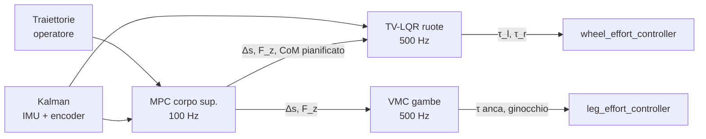

# Adattamento del modello WBR del paper a SeBaJu

Aggiornato al 16/09/2026 · Workspace `~/FSR_robot/MPC`

Riferimento: Z. Cui, Y. Xin, S. Liu, X. Rong, Y. Li, *Modeling and Control of a Wheeled Biped Robot*, Micromachines 2022, 13, 747 (file `MPC/Modeling and Control of a Wheeled Biped Robot-1.pdf`).

Il robot del paper (Scooter, idraulico, 80 kg, altezza anca–asse 0,6 m) è circa 19 volte più pesante e 3,3 volte più alto di SeBaJu (4,29 kg, 0,184 m). Tutti i parametri della Tabella 1 sono stati ricalcolati dall'URDF usato in simulazione con il modulo `sebaju_gazebo/wbr_model.py`:

```bash
ros2 run sebaju_gazebo wbr_model
```

Il modulo legge `sebaju.urdf.xacro`: se cambi l'URDF, i valori si aggiornano da soli.

## 1. Sintesi del paper

Il robot viene scomposto in due modelli semplici, ciascuno con il proprio controllore:

| Modello | Stato / ingresso | Controllore | Frequenza |
| --- | --- | --- | --- |
| VL-WIP: pendolo inverso su ruote a lunghezza variabile ℓ (eq. 4–5, 12–14) | X = [s, θ, φ, ṡ, θ̇, φ̇], U = [τ_l, τ_r] | TV-LQR, K ricalcolato al variare di ℓ (eq. 15–16) | 1000 Hz |
| Corpo superiore a massa concentrata (eq. 6–10) | x = [s, ṡ, z, ż, −g], u = [Δs, F_z] | MPC (QP) con vincoli su attrito, spazio di lavoro della gamba e forza verticale (eq. 17–18) | 100 Hz |
| Gambe | forze virtuali → coppie | Virtual Model Control: τ = Jᵀ[k_p(p_d − p_f) + k_d(v_d − v_f)] + τ_ff (eq. 19) | 1000 Hz |
| Stato | posizione/velocità del torso | Kalman lineare IMU + cinematica delle gambe (eq. 20–21) | 500 Hz |

Il CoM equivalente del corpo superiore (eq. 2–3) collega i due modelli: ℓ = √(S_C² + Z_C²), θ = atan(S_C / Z_C) nel sistema di riferimento dell'asse ruote.

## 2. Parametri della Tabella 1 adattati

| Parametro | Descrizione | Paper (Scooter) | SeBaJu (URDF) | Rapporto SeBaJu/paper |
| --- | --- | --- | --- | --- |
| m_w | Massa di una ruota | 3,5 kg | 0,38 kg | 0,11 |
| I_w | Inerzia della ruota sull'asse | 0,1 kg·m² | 0,00259 kg·m² | 0,026 |
| r | Raggio ruota | 0,127 m | 0,06 m | 0,47 |
| d | Distanza tra le ruote | 0,63 m | 0,294 m | 0,47 |
| m_b | Massa corpo superiore (totale − 2 m_w) | 73 kg | 3,53 kg | 0,048 |
| I_y | Inerzia di beccheggio | ⅓ m_b ℓ² | ⅓ m_b ℓ² = 0,0312 kg·m² (URDF: 0,0174) | — |
| I_z | Inerzia di imbardata | 3,3 kg·m² | 0,0227 kg·m² | 0,0069 |
| m_1 | Massa tibia (per gamba) | 1,2 kg | 0,16 kg | 0,13 |
| m_2 | Massa coscia (per gamba) | 5,3 kg | 0,18 kg | 0,034 |
| m_3 | Massa torso | 60 kg | 2,85 kg (2,50 + zavorra 0,35) | 0,048 |
| l_1 | Lunghezza tibia | 0,45 m | 0,130 m | 0,29 |
| l_2 | Lunghezza coscia | 0,45 m | 0,130 m | 0,29 |
| l_3 | Altezza torso | 0,35 m | 0,11 m | 0,31 |
| q_1, q_2, q_3 | Ginocchio, anca, beccheggio torso | — | `*_knee`, `*_hip`, beccheggio da `/sebaju/odom` | — |

I valori di I_y e I_z si riferiscono alla posa nominale (giunti a 0, torso orizzontale, ℓ = 0,163 m).

Parametri aggiuntivi usati da MPC e VMC (Sezione 4.2 del paper):

| Parametro | Significato | SeBaJu |
| --- | --- | --- |
| L_max | Lunghezza massima della gamba l_1 + l_2 | 0,260 m (raggiungibile ai limiti dei giunti: 0,245 m) |
| z_b | Distanza verticale anca–asse | 0,184 m nominale; 0,086–0,245 m entro i limiti ±0,9 rad |
| μ | Attrito ruota–suolo | 2,2 |
| Coppia max ruota | Limite URDF | 18 Nm |
| Coppia max anca/ginocchio | Limite URDF / servo Gazebo | 60 Nm |

## 3. Pendolo equivalente al variare dell'altezza

Con anca = −ginocchio/2 l'asse ruote resta sotto l'anca e il torso resta orizzontale. È la stessa condizione di "cambio altezza" usata nella Sezione 5.1.1 del paper.

| Anca [rad] | Ginocchio [rad] | z_b [m] | S_C [m] | Z_C [m] | ℓ [m] | θ [°] | I_y URDF [kg·m²] | I_y = ⅓ m_b ℓ² [kg·m²] |
| --- | --- | --- | --- | --- | --- | --- | --- | --- |
| −0,45 | +0,90 | 0,245 | +0,018 | 0,218 | 0,219 | +4,73 | 0,0201 | 0,0563 |
| −0,30 | +0,60 | 0,230 | +0,016 | 0,204 | 0,205 | +4,58 | 0,0194 | 0,0493 |
| −0,15 | +0,30 | 0,209 | +0,015 | 0,185 | 0,186 | +4,55 | 0,0184 | 0,0406 |
| 0 | 0 | 0,184 | +0,013 | 0,162 | 0,163 | +4,69 | 0,0174 | 0,0312 |
| +0,15 | −0,30 | 0,154 | +0,012 | 0,135 | 0,136 | +5,10 | 0,0163 | 0,0217 |
| +0,30 | −0,60 | 0,121 | +0,011 | 0,106 | 0,106 | +6,00 | 0,0153 | 0,0132 |
| +0,45 | −0,90 | 0,086 | +0,010 | 0,073 | 0,074 | +8,06 | 0,0145 | 0,0064 |

Con il torso orizzontale il CoM è 1,3 cm davanti all'asse (θ ≈ 4,7°). Questo angolo coincide con `PITCH_OFFSET = 4,73°` del controllore PID: in equilibrio il robot deve inclinarsi all'indietro di quell'angolo.

## 4. Matrici A(ℓ), B(ℓ) del VL-WIP

Coefficienti dell'eq. 14 calcolati per SeBaJu alla posa nominale (ℓ = 0,163 m). Sono stati verificati invertendo numericamente M(ϕ) dell'eq. 5: le differenze sono sotto 1e−12.

| Coefficiente | I_y = ⅓ m_b ℓ² (come nel paper) | I_y dall'URDF |
| --- | --- | --- |
| a_1 [m/s² per rad] | −8,42 | −10,60 |
| a_2 [1/s²] | +84,04 | +105,82 |
| b_1 [m/s² per Nm] | +6,90 | +7,93 |
| b_2 [rad/s² per Nm] | −39,83 | −50,15 |
| b_3 [rad/s² per Nm] | +34,88 | +34,88 |

```math
A(\ell)=\begin{bmatrix}0&0&0&1&0&0\\0&0&0&0&1&0\\0&0&0&0&0&1\\0&a_1&0&0&0&0\\0&a_2&0&0&0&0\\0&0&0&0&0&0\end{bmatrix},\qquad
B(\ell)=\begin{bmatrix}0&0\\0&0\\0&0\\b_1&b_1\\b_2&b_2\\b_3&-b_3\end{bmatrix}
```

Segno di imbardata: nel paper la ruota sinistra sta su −y (Fig. 2a). In ROS (REP 103) sta su +y, quindi `wbr_model.py` usa l'ultima riga [−b_3, b_3].

Il polo instabile del pendolo è √a_2: circa 9,2 rad/s nella posa nominale (10,3 rad/s con I_y dall'URDF). Il TV-LQR deve quindi avere una banda ben sopra 1,5 Hz: i 500 Hz di `controller_manager` sono sufficienti.

Da codice:

```python
from sebaju_gazebo.wbr_model import WBRModel
model = WBRModel(robot_description)                   # stesso parametro del controller PID
e = model.equivalent_centroid(hip, knee, pitch)       # eq. 2-3: l, theta, I_y, z_b
A, B = model.vlwip_matrices(e['l'], I_y=e['I_y'])     # eq. 13-14
Ac, Bc = model.upper_body_matrices(h=e['Z_C'])        # eq. 9
```

## 5. Scenari di prova riscalati

Le prove del paper sono riscalate con la similitudine di Froude, a parità di gravità. Il fattore di scala delle lunghezze è λ = 0,184 / 0,6 = 0,306. Le velocità scalano con √λ = 0,55, i tempi con √λ, le accelerazioni restano uguali e le masse seguono il rapporto 4,29 / 80 = 0,054.

| Prova (Sez. 5.1) | Paper | SeBaJu (riscalato) |
| --- | --- | --- |
| Cambio altezza | 0,6 m ± 0,1 m, sinusoide, periodo ≈ 4 s | 0,153–0,215 m (anca da +0,15 a ≈ −0,19 rad, ginocchio = −2·anca), periodo ≈ 2,2 s |
| Impatto sagittale | Pendolo 50 kg a 1,8 m/s sul torso | ≈ 2,7 kg a ≈ 1,0 m/s |
| Inseguimento velocità | v_max 0,8 m/s, a_max 0,6 m/s², spostamento ≈ 6,5 m | v_max ≈ 0,44 m/s, a_max 0,6 m/s², spostamento ≈ 2 m |
| Salto | Ruote a 0,8 m da terra | ≈ 0,25 m (solo scala geometrica: dipende dalla coppia dei servo) |
| Vincolo MPC Δs | min(μh, √(L_max² − z_b²)) | min(0,40; 0,184) = ±0,18 m alla posa nominale |

## 6. Differenze da tenere presenti

- **Geometria delle gambe:** il paper usa una convenzione D-H di cui non riporta la tabella né gli offset. In SeBaJu, a giunti a zero, coscia e tibia formano una "V" a 90°: gli angoli q_1, q_2 del paper non corrispondono direttamente a `*_knee`, `*_hip`. `wbr_model.py` evita il problema calcolando le posizioni direttamente dall'URDF.
- **Posizione dell'anca:** nel paper l'anca è sotto il torso (l_3 = altezza del torso sopra l'anca). In SeBaJu l'anca è al centro del box e il CoM del torso è 2,7 cm avanti e 0,55 cm sotto l'anca: l_3 ha solo valore geometrico.
- **I_y:** la formula ⅓ m_b ℓ² del paper sovrastima di 1,8 volte l'inerzia reale alla posa nominale e cambia andamento con l'altezza. Per il TV-LQR conviene usare il valore dall'URDF (`equivalent_centroid()['I_y']`).
- **Inerzia ruote:** il 77% di I_w (0,002 su 0,00259 kg·m²) è l'armatura del motore ereditata da MuJoCo. Anche nel paper I_w / (m_w r²) = 1,77 indica che è inclusa l'inerzia del rotore.
- **Attuazione delle gambe:** nel paper sono idrauliche a coppia, necessarie per il VMC (eq. 19). Nel workspace PID anche e ginocchia sono servo di posizione di Gazebo; nel workspace MPC sono state portate in coppia con `leg_effort_controller` (sezione 7).
- **Stima dello stato:** il paper usa un Kalman IMU + encoder. Il controllore PID usa l'odometria ideale di Gazebo; il controllore MPC usa solo IMU, encoder e contatti, come nel paper (sezione 7).
- **Frequenze:** il paper usa MPC a 100 Hz, stimatore a 500 Hz, LQR e VMC a 1000 Hz. In SeBaJu `controller_manager` va a 500 Hz, quindi LQR, VMC e stimatore girano a 500 Hz e l'MPC a 100 Hz.

## 7. Implementazione del controllore nel workspace MPC

Nel workspace `~/FSR_robot/MPC` il controllore PID è stato sostituito dall'architettura del paper (Fig. 4): nodo `wbr_controller`. Il workspace `~/FSR_robot/PID` resta invariato.



| File | Contenuto |
| --- | --- |
| `sebaju_gazebo/wbr_controller.py` | Nodo: stima, macchina a stati del salto, riferimenti, LQR, MPC, VMC, telemetria |
| `sebaju_gazebo/wbr_mpc.py` | Riccati continua (LQR), tabella K(ℓ), QP con vincoli di box (FISTA), MPC condensato, Kalman per asse; solo NumPy |
| `sebaju_gazebo/wbr_model.py` | Parametri dall'URDF, CoM equivalente, A(ℓ)/B(ℓ), cinematica e jacobiano della gamba |
| `urdf/sebaju.urdf.xacro` | Anca e ginocchia con interfaccia `effort`; rimossi i servo di posizione Gazebo |
| `config/sebaju_controllers.yaml` | Aggiunto `leg_effort_controller` |
| `worlds/sebaju_world.sdf` | Aggiunto `ApplyLinkWrench` per la prova di impatto |

### 7.1 Come è realizzato ciascun blocco

- **Stima (eq. 20–21):** tre filtri di Kalman lineari (x, y, z) con ingresso l'accelerazione IMU nel sistema mondo. L'osservazione è la posizione/velocità dell'asse da odometria ruote + cinematica gambe. In volo la correzione è sospesa. L'odometria ideale `/sebaju/odom` serve solo a pubblicare l'errore di stima.
- **TV-LQR (eq. 12–16):** K calcolato all'avvio su 25 altezze (ℓ da 0,074 a 0,219 m, I_y dall'URDF) e interpolato in ℓ. Q = diag(30, 400, 80, 15, 6, 2). R pesa separatamente la coppia di modo comune (bilanciamento, r = 2, equivalente a R = I) e quella differenziale (imbardata, r = 100); vedi sezione 9.3. Il riferimento di s e ṡ è lo stato del baricentro pianificato dall'MPC al passo successivo; θ_ref = atan(Δs / z_ref).
- **MPC (eq. 9, 17–18):** i due blocchi orizzontale [s, ṡ] → Δs e verticale [z, ż] → F_z sono disaccoppiati. Ognuno è un QP condensato con orizzonte 25 × 0,02 s = 0,5 s e vincoli |Δs| ≤ min(μh, √(L_max² − z_b²), 3 cm), 0,3 m_b g ≤ F_z ≤ 3 m_b g (6 m_b g in spinta). Risolto in circa 1 ms.
- **VMC (eq. 19):** per ogni gamba τ = Jᵀ[K_p(p_d − p_f) + K_d(v_d − v_f) + F_ff] + τ_ff. In appoggio la molla è solo orizzontale (1500 N/m) per realizzare Δs; in verticale agisce F_z dell'MPC. τ_ff compensa lo smorzamento dei giunti dell'URDF (0,8 N·m·s/rad), senza il quale il cambio di altezza aveva metà ampiezza.
- **Salto (Fig. 11):** BALANCE → PRELOAD (accovacciamento a 0,12 m anca-asse in 0,8 s) → THRUST (accelerazione costante fino a `jump_velocity` a piena estensione) → FLIGHT (ruote ferme, gambe a 0,17 m) → LANDING (ritorno all'altezza nominale in 1 s) → BALANCE.

### 7.2 Risultati in Gazebo (16/09/2026)

Tutte le prove sono state eseguite senza GUI, confrontando la stima con l'odometria reale di Gazebo.

| Prova (paper) | Comando | Risultato |
| --- | --- | --- |
| Bilanciamento | (default) | Beccheggio −0,8…+1,8°, errore di stima < 1 mm |
| Cambio altezza (5.1.1) | `height_enable:=true` | z 0,131–0,187 m su riferimento 0,132–0,192 m, errore rms 3,4 mm, θ max 0,1° |
| Impatto (5.1.2) | `push_enable:=true` | 2,7 N·s: velocità −0,69 m/s, spostamento 0,30 m, beccheggio max 5,3°, recupero in circa 4 s |
| Inseguimento velocità (5.1.3) | `velocity_enable:=true` | 0,440 m/s di crociera, arresto a 1,986 m reali su 2,0 m |
| Salto (5.1.4) | `jump_enable:=true` | Volo 0,21 s, torso da 0,244 a 0,324 m, atterraggio stabile; torso ruota fino a −23° in volo |
| Traiettoria a S | `planar_enable:=true` | Arrivo a (2,89; 0,62) m, errore di imbardata max 3,6° |
| Avanti-indietro | `drive_enable:=true` | Errore di posizione max 1,1 cm |

### 7.3 Comandi

```bash
source /opt/ros/humble/setup.bash
cd ~/FSR_robot/MPC && colcon build --packages-select sebaju_gazebo --symlink-install && source install/setup.bash

ros2 launch sebaju_gazebo sebaju_gazebo.launch.py                            # bilanciamento
ros2 launch sebaju_gazebo sebaju_gazebo.launch.py height_enable:=true        # cambio altezza
ros2 launch sebaju_gazebo sebaju_gazebo.launch.py push_enable:=true          # impatto
ros2 launch sebaju_gazebo sebaju_gazebo.launch.py velocity_enable:=true      # inseguimento velocità
ros2 launch sebaju_gazebo sebaju_gazebo.launch.py jump_enable:=true          # salto
ros2 launch sebaju_gazebo sebaju_gazebo.launch.py planar_enable:=true        # traiettoria a S
ros2 launch sebaju_gazebo sebaju_gazebo.launch.py mpc_enable:=false          # solo TV-LQR, gambe rigide
ros2 launch sebaju_gazebo test_bench.launch.py jump_enable:=true             # con CSV e PlotJuggler
ros2 launch sebaju_gazebo sebaju_gazebo.launch.py --show-args                # tutti gli argomenti
ros2 launch sebaju_gazebo sebaju_gazebo.launch.py jump_enable:=true dashboard:=true   # con dashboard real-time
```

Topic aggiuntivi: `/sebaju/wbr_state` (18 valori: s, θ, φ, z con i riferimenti, Δs, F_z, coppie, ℓ), `/sebaju/estimation_error` (stima − verità, posizione e velocità). `/sebaju/debug` mantiene il formato del controllore PID, quindi logger CSV e layout PlotJuggler funzionano senza modifiche.

### 7.4 Limiti noti

- **Rotazione in volo:** il torso ruota fino a −23°, perché in volo il VMC non controlla il beccheggio.
- **Guadagni:** Q, R e i pesi dell'MPC sono costanti in testa a `wbr_controller.py`, non parametri ROS. Con Q_φ ≥ 400 l'imbardata diventa instabile.
- **CPU:** il nodo Python usa circa 1 ms per ciclo sui 2 ms disponibili. Con il sistema carico può saltare un ciclo; il filtro di Kalman usa il dt reale per tollerarlo.

## 8. Dashboard real-time (`sebaju_dashboard`)

Interfaccia grafica per seguire la simulazione in tempo reale, scritta in Python con PyQt5 e pyqtgraph (entrambi open source). Si apre da sola con `dashboard:=true`, oppure in un altro terminale:

```bash
ros2 run sebaju_dashboard dashboard
```

| Area | Contenuto |
| --- | --- |
| Stato del robot | Un LED per fase: Aggancio, Bilanciamento, Accovacciamento, Spinta, Volo, Atterraggio (più Recupero e Assestamento del controllore PID), con il tempo trascorso nella fase |
| Diagnostica | Simulazione e controllore attivi, ruota SX/DX a terra con spinta della gamba, robot a terra, saturazione ruote e gambe, errore della stima di stato, caduta, ritardo sotto i 100 ms |
| Vista laterale | Torso, gambe, ruote con raggi e baricentro, calcolati dai giunti; frecce per reazione del suolo, F_z richiesta dall'MPC e forza di trazione delle ruote |
| Valori istantanei | θ, s, ṡ, z con i riferimenti, Δs, F_z, spinta delle gambe, coppie ruote, imbardata, posizione, frequenza del controllore, ritardo |
| Cambi di stato | Cronologia delle fasi con l'istante simulato |
| Grafici (12) | Inclinazione, posizione, velocità, altezza, forze verticali, coppie ruote, coppie gambe, Δs, imbardata, angoli gambe, velocità ruote, errore di stima |

Comandi: Pausa, finestra temporale 5–60 s, 15/30/60 FPS, Azzera, Salva immagine (PNG nella cartella corrente).

### 8.1 Come rispetta il ritardo massimo

- **Processo ROS separato:** le sottoscrizioni girano in un processo dedicato che scrive in buffer circolari in memoria condivisa (60 s a 500 Hz). Il processo grafico non riceve messaggi ROS, quindi non c'è contesa sul GIL di Python.
- **Code di un messaggio:** QoS best effort con profondità 1. Sotto carico si perdono campioni vecchi invece di accumulare ritardo.
- **Disegno leggero:** ogni frame legge solo la finestra visibile e riduce ogni curva a 800 punti, tenendo minimo e massimo di ogni intervallo, così i picchi restano visibili.

Misure in Gazebo durante un salto: 21–31 FPS, ritardo dati → schermo 33–53 ms, topic ricevuti a circa 480 Hz. L'indicatore "Ritardo" diventa rosso sopra i 100 ms.

### 8.2 Note

- **Forze di contatto:** in Gazebo Fortress i messaggi di contatto non riportano le forze. La dashboard usa i contatti solo come stato a terra/sollevata. La forza di ogni gamba è calcolata dalle coppie comandate, F = −J⁻ᵀτ, e non è mostrata vicino alla gamba tutta distesa, dove il jacobiano è singolare.
- **Beccheggio del torso e schema:** usano l'odometria ideale di Gazebo, solo per la visualizzazione.
- **Fase corrente:** `wbr_controller` ripubblica `/sebaju/jump_state` a 10 Hz, così la dashboard la conosce anche se viene aperta a simulazione già avviata.
- **Dipendenza:** pyqtgraph è stato installato per l'utente con `/usr/bin/python3 -m pip install --user --no-deps pyqtgraph`, senza modificare NumPy.
- **Chiusura:** con Ctrl+C, chiudendo la finestra o con SIGTERM la memoria condivisa viene liberata. I segmenti lasciati da una dashboard terminata in modo brusco vengono rimossi al successivo avvio.

## 9. Comandi in tempo reale

Oltre ai profili scelti all'avvio (sezione 7.3), `wbr_controller` accetta comandi mentre il robot è in movimento. Appena arriva il primo comando i profili predefiniti vengono disattivati e i riferimenti partono dallo stato attuale, senza scatti.

| Topic | Tipo | Significato | Limiti |
| --- | --- | --- | --- |
| `/sebaju/cmd_vel` | `geometry_msgs/Twist` | `linear.x` velocità in avanti [m/s], `angular.z` rotazione [rad/s], positiva a sinistra | ±0,6 m/s, ±1,5 rad/s; accelerazione `accel_max` (0,6 m/s²) e 3 rad/s² |
| `/sebaju/cmd_height` | `std_msgs/Float64` | Scostamento dell'altezza del baricentro dalla posa nominale [m] | da −0,05 a +0,04 m, a 0,08 m/s |
| `/sebaju/cmd_jump` | `std_msgs/Empty` | Richiesta di salto: il robot rallenta fino a fermarsi e poi salta | Solo in bilanciamento |
| `/sebaju/cmd_push` | `std_msgs/Float64` | Impulso orizzontale sul torso [N·s], positivo in avanti | ±6 N·s |

Sicurezza e robustezza:
- **Timeout:** se `/sebaju/cmd_vel` non arriva per 0,5 s, velocità e rotazione tornano a zero. Chi comanda deve ripubblicare almeno a 2 Hz; la dashboard lo fa a 20 Hz.
- **Priorità al bilanciamento:** la coppia per ruotare è limitata a ±2,5 Nm per ruota e il bilanciamento ha la precedenza sulla coppia.
- **Anti-windup:** il riferimento di imbardata non si allontana più di 20° dall'orientamento reale.
- **Stabilità verificata:** con 1,5 rad/s a regime il robot ruota a 1,50 rad/s con errore di imbardata ±1,1°. Su tutto l'intervallo le coppie ruote restano sotto 1 Nm e il beccheggio sotto 3,4°.

### 9.1 Dalla dashboard

In alto sopra i grafici c'è il pannello **Comandi**:
- **Attiva:** avvia l'invio continuo dei comandi. Togliendo la spunta il robot riceve velocità zero e si ferma.
- **Cursori:** velocità (±0,6 m/s), rotazione (±1,5 rad/s, cursore a destra = gira a destra), altezza (da −50 a +40 mm).
- **Pulsanti:** Stop (velocità e rotazione a zero), Altezza 0, Salta, Spinta avanti/indietro con impulso regolabile.

Tastiera, con la finestra in primo piano:

| Tasto | Azione |
| --- | --- |
| W / S | Velocità +0,05 / −0,05 m/s (attiva i comandi) |
| A / D | Rotazione a sinistra / a destra di 0,1 rad/s |
| R / F | Altezza +5 / −5 mm |
| Spazio | Stop |
| J | Salto |

Il LED "Comandi manuali" della diagnostica è acceso quando i comandi sono attivi e mostra i valori inviati.

### 9.2 Da terminale

```bash
# tastiera standard ROS 2 (i avanti, j/l ruota, k stop, , indietro)
ros2 run teleop_twist_keyboard teleop_twist_keyboard --ros-args -r cmd_vel:=/sebaju/cmd_vel

# comandi singoli
ros2 topic pub -r 10 /sebaju/cmd_vel geometry_msgs/msg/Twist "{linear: {x: 0.3}, angular: {z: 0.5}}"
ros2 topic pub --once /sebaju/cmd_height std_msgs/msg/Float64 "{data: 0.03}"
ros2 topic pub --once /sebaju/cmd_jump std_msgs/msg/Empty "{}"
ros2 topic pub --once /sebaju/cmd_push std_msgs/msg/Float64 "{data: -2.0}"
```

`teleop_twist_keyboard` parte con 0,5 m/s e 1,0 rad/s: il controllore li limita comunque a ±0,6 m/s e ±1,5 rad/s. Per `/sebaju/cmd_vel` serve `-r 10`, altrimenti dopo 0,5 s scatta il timeout.

### 9.3 Oscillazione di imbardata a 12 Hz (risolta)

Con il primo tuning (R = I) un comando di 1,5 rad/s innescava un'oscillazione permanente, misurata sull'odometria reale di Gazebo:

| | Prima | Dopo |
| --- | --- | --- |
| Velocità di imbardata a regime (comando 1,5 rad/s) | media 1,49 rad/s, oscillazione ±2,8 rad/s a 12,3 Hz | media 1,50 rad/s, ±0,17 rad/s, nessuna componente a 12 Hz |
| Dopo lo stop | oscillazione ancora ±2,8 rad/s a 12,8 Hz, senza fine | fermo entro 4 s, errore residuo 1,7° |
| Coppia differenziale | ±2,5 Nm, saturata il 60% del tempo | 0,40 Nm medi, mai saturata |
| Beccheggio durante la rotazione | picco-picco 12° a 1 Hz | picco-picco 1° |
| Traiettoria a S: errore di imbardata max | 3,6° | 9,0° (arrivo invariato: 2,89; 0,63 m) |

**Causa.** Il giroscopio è sul torso, la coppia agisce sulle ruote e in mezzo ci sono le gambe. In appoggio le gambe sono molle virtuali orizzontali (1500 N/m ciascuna). Il torso (0,014 kg·m²) ruota rispetto all'asse (0,060 kg·m², armatura dei motori inclusa) con rigidezza 2·1500·0,147² ≈ 65 N·m/rad, quindi c'è una risonanza torsionale a 76 rad/s = 12,2 Hz. Con R = I l'anello di velocità di imbardata tagliava proprio a 76 rad/s (b₃ = 34,9 rad/s²/Nm per l'inerzia di imbardata molto piccola). Il sistema, con sensore non co-locato e saturazione, andava in ciclo limite. L'attrito di strisciamento delle ruote lo manteneva anche a comando nullo.

**Correzione.**
1. **LQR con R separato:** R = Tᵀ·diag(2, 100)·T, dove T trasforma [τ_l, τ_r] in [comune, differenziale]. I guadagni di bilanciamento restano identici; quelli di imbardata scendono da 6,3 a circa 0,9 Nm/rad e da 1,09 a circa 0,23 Nm·s/rad, e il taglio passa a circa 16 rad/s, 4,7 volte sotto la risonanza.
2. **Compensazione dell'attrito di strisciamento**, identificato in Gazebo: 0,25 Nm per ruota (Coulomb) + 0,10 Nm·s/rad (viscoso), calcolata dalla velocità di rotazione di riferimento.
3. **Integrale lento sull'errore di orientamento:** 0,6 Nm/(rad·s), limitato a ±0,6 Nm, con banda morta di 2° per evitare scatti di attacco e stacco da fermo.

Senza i punti 2 e 3 il robot girava solo a 0,56 rad/s su 1,5: con guadagno alto la vibrazione mascherava l'attrito.
