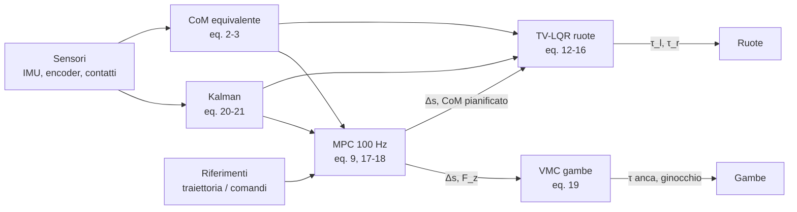
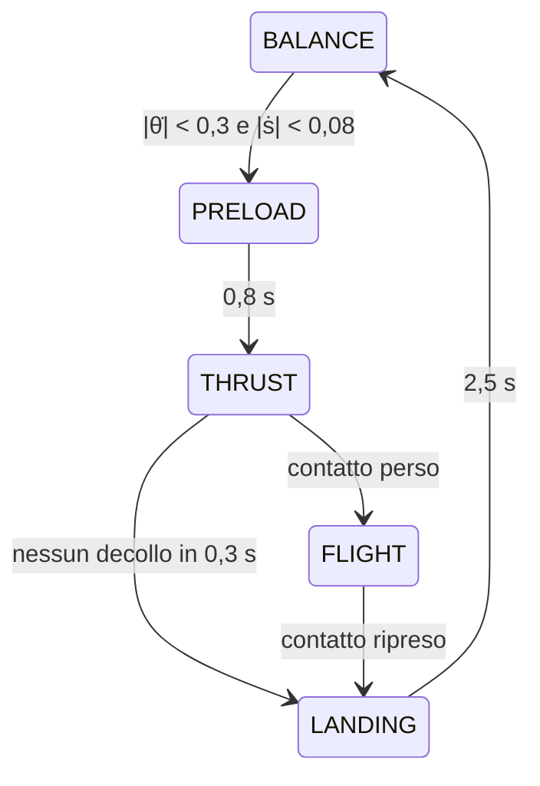

# Sistema di controllo di SeBaJu: progetto e giustificazioni

Aggiornato al 16/09/2026 · Workspace `~/FSR_robot/MPC`

Riferimento: Z. Cui et al., *Modeling and Control of a Wheeled Biped Robot*, Micromachines 2022, 13, 747. "Eq. n" indica le equazioni del paper.

File citati, tutti in `src/sebaju_gazebo/sebaju_gazebo/`:
- **`wbr_controller.py`** (`C:`): il nodo di controllo.
- **`wbr_mpc.py`** (`N:`): LQR, QP, MPC e filtro di Kalman.
- **`wbr_model.py`** (`M:`): modello ricavato dall'URDF.

I valori numerici valgono per la posa nominale (anca e ginocchio a 0, ℓ = 0,163 m), salvo dove indicato.

---

## 1. Il problema e l'architettura

**Perché serve un controllo dinamico.** Nel piano sagittale SeBaJu ha 4 gradi di libertà: avanzamento dell'asse, beccheggio del torso, anca, ginocchio. Gli attuatori sono 3: ruota, anca, ginocchio. Il sistema è quindi sottoattuato di un grado: il beccheggio non si può imporre direttamente. L'equilibrio si ottiene solo muovendo le ruote sotto il baricentro, come in un pendolo inverso.

**L'idea del paper (Sez. 3).** Invece di un modello a corpo intero (non lineare, 6+ gradi di libertà) il robot viene diviso in due modelli semplici, ciascuno col suo controllore:
- **Ruote:** un pendolo inverso su ruote a lunghezza variabile (VL-WIP), stabilizzato da un TV-LQR.
- **Gambe:** il corpo superiore visto come una massa concentrata, controllato da un MPC che ne decide posizione orizzontale e forza verticale.

Il collegamento tra i due è il **baricentro equivalente** (eq. 2–3). Le gambe lo spostano; le ruote vedono solo la sua lunghezza ℓ e inclinazione θ.



**Frequenze.** Il paper (Fig. 4) usa 100 Hz per MPC e traiettorie, 500 Hz per lo stimatore, 1000 Hz per LQR e VMC. Qui tutto gira a 500 Hz, l'MPC a 100 Hz (`C:65` `MPC_EVERY = 5`). Il limite è `controller_manager` a 500 Hz. Basta comunque: il polo instabile più veloce del pendolo è a 10,8 rad/s (1,7 Hz, sez. 3), circa 290 volte sotto la frequenza di campionamento.

**Ciclo di controllo.** Il nodo non usa un timer: calcola un passo a ogni `/joint_states` (`C:_joint_state_cb`), con il `dt` ricavato dai timestamp simulati. Le code dei sensori hanno profondità 1. Se il nodo resta indietro salta campioni vecchi invece di accumulare ritardo, e tutto ciò che integra usa il `dt` reale (sez. 7). L'ordine di `C:498–700` è: IMU → cinematica e CoM equivalente → contatti → Kalman → macchina a stati → riferimenti → MPC → LQR → VMC. Ogni blocco usa lo stato aggiornato dal precedente nello stesso passo.

---

## 2. Il baricentro equivalente (eq. 1–3)

```math
{}^{w}P_C=\frac{\sum_i m_i\,{}^{w}P_{Ci}(q)}{\sum_i m_i},\qquad
\ell=\sqrt{S_C^2+Z_C^2},\qquad \theta=\operatorname{atan}\frac{S_C}{Z_C}
```

**Codice.** `M:137–145` calcola il CoM del corpo superiore nel frame del torso; `C:521–525` lo porta nel frame dell'asse e ricava ℓ e θ.

- **Solo il corpo superiore (m_b = 3,53 kg, `M:102`).** Le ruote hanno il baricentro sull'asse: non producono coppia attorno ad esso e compaiono già come m_w nell'eq. 5. Portare il CoM del corpo superiore sopra l'asse equivale a portarci il CoM totale.
- **Cinematica dall'URDF invece del D-H del paper (eq. 1).** Il paper non riporta tabella né offset D-H. Inoltre in SeBaJu, a giunti nulli, coscia e tibia formano una "V" a 90°, quindi un D-H scritto a mano introdurrebbe errori di segno e offset. La catena `RobotKinematics` legge frame e masse direttamente dall'URDF di simulazione.
- **Frame "asse, orizzontale".** S_C si proietta sulla direzione di marcia orizzontale (`C:522`) e Z_C è verticale: così θ è l'inclinazione rispetto alla gravità, che è ciò che conta per l'equilibrio. Il torso inclinato entra tramite R dell'IMU (`C:521`).
- **θ̇ per derivata numerica filtrata (`C:528`, α = 0,8).** θ dipende sia dal beccheggio sia dal movimento delle gambe, quindi il solo giroscopio non basta. Il filtro del primo ordine ha τ = 9 ms (taglio 17,8 Hz): ben sopra i poli dominanti (≤ 8,1 rad/s, sez. 3.3) e sotto le vibrazioni di contatto. Il polo rapido a −180 rad/s nasce dal termine θ̇ stesso: il filtro lo rallenta ma non lo destabilizza, come verificato in simulazione.

---

## 3. VL-WIP e TV-LQR (eq. 4–5, 11–16)

### 3.1 Il modello

Stato ϕ = [s, θ, φ] (avanzamento, inclinazione, imbardata). Con Euler–Lagrange (eq. 4) si ottiene M(ϕ)ϕ̈ + C(ϕ,ϕ̇) = Bτ con M, C, B dell'eq. 5. Linearizzando attorno a θ = 0 (eq. 12) il sistema diventa Ẋ = A(ℓ)X + B(ℓ)U, con X = [s, θ, φ, ṡ, θ̇, φ̇] e U = [τ_l, τ_r]:

```math
\ddot s=a_1\theta+b_1(\tau_l+\tau_r),\qquad
\ddot\theta=a_2\theta+b_2(\tau_l+\tau_r),\qquad
\ddot\varphi=b_3(\tau_r-\tau_l)
```

**Codice.** Coefficienti dell'eq. 14 in `M:180–195`, matrici dell'eq. 13 in `M:197–209`. Li ho verificati invertendo numericamente M dell'eq. 5 (differenza < 1e−12).

**Proprietà che guidano il progetto:**

| ℓ [m] | a₂ [1/s²] | polo instabile √a₂ [rad/s] | b₂ [rad/s²/Nm] |
| --- | --- | --- | --- |
| 0,074 (accovacciato) | 116,9 | 10,8 | −80,4 |
| 0,163 (nominale) | 105,8 | 10,3 | −50,2 |
| 0,219 (esteso) | 89,2 | 9,4 | −38,2 |

- **Il pendolo cambia molto con l'altezza.** Il guadagno di controllo b₂ varia di un fattore 2,1 tra accovacciato ed esteso: un K fisso sarebbe troppo aggressivo in basso o troppo debole in alto. Da qui il TV-LQR del paper.
- **Imbardata.** b₃ = 34,9 rad/s²/Nm è molto alto per la piccola inerzia di imbardata (0,023 kg·m², più l'armatura delle ruote). Ha conseguenze importanti, vedi sez. 4.
- **Segno dell'imbardata (`M:208`).** Nella Fig. 2a del paper la ruota sinistra sta su −y. In ROS (REP 103) sta su +y, quindi la riga di φ̈ è [−b₃, b₃].
- **I_y dall'URDF, non ⅓m_bℓ² (tabella 1 del paper).** La formula del paper sovrastima l'inerzia di 1,8 volte alla posa nominale e cresce con ℓ², mentre quella reale varia solo da 0,0145 a 0,0201 kg·m². I campioni (ℓ, I_y) sono calcolati dall'URDF (`C:173`).

### 3.2 Calcolo di K

- **Riccati senza scipy (`N:15–30`).** Nel Python di ROS scipy non si carica (conflitto con NumPy 2 in `~/.local`). L'equazione algebrica di Riccati si risolve dal sottospazio stabile dell'Hamiltoniana [[A, −BR⁻¹Bᵀ], [−Q, −Aᵀ]], con P = U₂U₁⁻¹: metodo esatto e diretto per un sistema 6×6.
- **Tabella invece di Riccati in linea (`N:33–45`, `C:176`).** K è precalcolato su 25 altezze (ℓ da 0,074 a 0,219 m) e interpolato linearmente in ℓ a ogni passo. A e B variano in modo regolare con ℓ: tra un campione e l'altro K cambia in media dello 0,6%, e risolvere Riccati a 500 Hz sarebbe solo costo.

### 3.3 Pesi Q e R (eq. 15)

`C:41–48`: Q = diag(30, 400, 80, 15, 6, 2) su [s, θ, φ, ṡ, θ̇, φ̇]. R pesa separatamente modo comune (r = 2) e differenziale (r = 100): R = Tᵀ diag(2, 100) T, con [comune, diff] = T·[τ_l, τ_r].

| Scelta | Motivo |
| --- | --- |
| Q_θ = 400 dominante | L'equilibrio viene prima di tutto: guadagno θ di 18,4–21,2 Nm/rad per ruota, vicino ai 23,4 Nm/rad del PID già collaudato |
| Q_s = 30, Q_ṡ = 15 bassi | La posizione si corregge lentamente (poli −1,08 ± 0,68j) senza rubare coppia all'equilibrio; seguire la traiettoria è compito dell'MPC |
| Q_θ̇ = 6 | Smorzamento: il polo sagittale veloce è a −180 rad/s, ancora gestibile a 500 Hz |
| r_comune = 2 | Rende i guadagni sagittali identici a quelli con R = I, su cui è stato tarato il bilanciamento |
| r_diff = 100 | Tiene la banda di imbardata sotto la risonanza delle gambe (sez. 4) |

Poli in anello chiuso alla posa nominale:
- **Posizione:** −1,08 ± 0,68j.
- **Inclinazione:** −8,13 e −179,5.
- **Imbardata:** −7,45 ± 2,62j.

In tutta la gamma di altezze la parte reale massima resta tra −0,86 e −1,15.

### 3.4 Riferimento e legge di controllo (eq. 16)

`C:639–660`:

```math
U=-K(\ell)\,(X-X_{ref}),\qquad X_{ref}=\big[s_{plan}-\Delta s,\;\operatorname{atan}\tfrac{\Delta s}{z_{ref}},\;\varphi_{ref},\;\dot s_{plan},\;0,\;\dot\varphi_{ref}\big]
```

- **θ_ref dall'eq. 3 applicata al CoM desiderato (`C:640`).** Se l'MPC chiede il baricentro Δs davanti all'asse all'altezza z_ref, l'inclinazione coerente è atan(Δs/z_ref). È il "Virtual COM" che nella Fig. 4 passa dal controllore task-space all'LQR.
- **s e ṡ dal piano dell'MPC, non dalla traiettoria dell'operatore (`C:641–647`).** Nella prima versione l'LQR inseguiva la traiettoria dell'operatore mentre l'MPC inclinava il robot per accelerare. I due si opponevano e il robot oscillava a 1,2 Hz fino a 39° di beccheggio. Ora l'LQR insegue lo stato pianificato dall'MPC al passo successivo, interpolato tra due soluzioni. Il riferimento di posizione dell'asse è s_plan − Δs, perché l'asse sta Δs dietro al baricentro.
- **Ripartizione della coppia (`C:651–660`).** U si scompone in parte comune (equilibrio) e differenziale (imbardata). La differenziale è limitata a ±2,5 Nm; la comune usa il margine restante fino a ±10 Nm. Così una curva brusca non può mai togliere coppia all'equilibrio. Il limite di 10 Nm, contro i 18 dell'URDF, lascia riserva per gli impatti.

---

## 4. Imbardata: risonanza delle gambe e attrito

**Modello.** La terza riga dell'eq. 5 descrive un doppio integratore: φ̈ = b₃(τ_r − τ_l). Nel modello ideale ogni guadagno PD è stabile. In simulazione, però, un guadagno alto innescava un'oscillazione permanente a 12,5 Hz (±2,8 rad/s). Due fenomeni non sono nel modello del paper.

**1. Risonanza torsionale delle gambe.** Il giroscopio è sul torso, la coppia sulle ruote, e in appoggio le gambe sono molle orizzontali del VMC (1500 N/m, sez. 6). Il torso (0,0136 kg·m²) ruota rispetto al gruppo asse-gambe (0,060 kg·m²) con rigidezza k_t = 2·1500·(d/2)² = 65 N·m/rad:

```math
\omega_{res}=\sqrt{k_t\left(\tfrac{1}{J_{asse}}+\tfrac{1}{J_{torso}}\right)}=76\ \text{rad/s}\ (12{,}2\ \text{Hz})
```

Con R = I il guadagno di velocità di imbardata era 1,09 Nm·s/rad, con taglio 2·b₃·k_d = 76 rad/s: esattamente sulla risonanza. Sensore non co-locato più saturazione dà un ciclo limite.

**Scelta:** r_diff = 100 (`C:46`) porta i guadagni a k_p = 0,894 Nm/rad e k_d = 0,214 Nm·s/rad. Il taglio scende a 14,9 rad/s, 5 volte sotto la risonanza. Aumentare la rigidezza delle gambe avrebbe spostato la risonanza, ma anche cambiato l'anello di Δs (sez. 6).

**2. Attrito di strisciamento.** Le ruote larghe (56 mm) strisciano in rotazione. Con il guadagno alto la vibrazione faceva da dither e mascherava l'attrito. Con guadagno basso il robot girava a 0,56 rad/s su 1,5 e restava fermo con 20° di errore. Identificato in Gazebo: 0,23 Nm per ruota da fermo e 0,38 Nm a 0,56 rad/s. Tre termini a bassa frequenza, lontani dalla risonanza (`C:651–658`, costanti `C:53–59`):

```math
\tau_{diff}=\underbrace{-K_\varphi e}_{\text{LQR}}+\underbrace{0{,}25\tanh\!\frac{\dot\varphi_{ref}}{0{,}01}+0{,}10\,\dot\varphi_{ref}}_{\text{attrito, in anticipo}}+\underbrace{0{,}6\!\int\! e_\varphi\,dt}_{|\cdot|\le 0{,}6,\ \text{banda morta }2°}
```

- **Compensazione dal riferimento, non dalla misura.** Dipendere da φ̇_ref (liscio) invece che da φ̇ misurato evita commutazioni rapide attorno a velocità nulla. Per questo il tanh può essere quasi un gradino.
- **Integrale con banda morta di 2°.** Recupera l'errore residuo; senza banda morta, da fermo accumulerebbe coppia fino allo stacco, con piccoli scatti ripetuti.
- **Due limiti anti-windup a 20°.** Uno sull'errore (`C:649`), uno sul riferimento, che non può anticipare il robot (`C:335–337`). Se si comanda una rotazione che l'attrito non permette, l'errore non cresce all'infinito.

**Risultato.** Con comando 1,5 rad/s il robot ruota a 1,50 ± 0,17 rad/s, errore ±1,1°, coppia differenziale 0,40 Nm mai saturata; dopo lo stop si ferma in 4 s. Il prezzo: sulla traiettoria a S l'errore massimo di imbardata passa da 3,6° a 9°.

---

## 5. MPC del corpo superiore (eq. 6–10, 17–18)

### 5.1 Il modello

Il corpo superiore è ridotto a una massa m_b all'altezza h sopra l'asse (Sez. 3.3). Perché non si ribalti, la risultante di gravità e inerzia deve passare per il contatto (eq. 6: F_s/Δs = F_z/h). Da qui:

```math
\ddot s=\frac{g+\ddot z}{h}\,\Delta s\quad(\text{eq. 7}),\qquad \ddot z=\frac{F_z}{m_b}-g\quad(\text{eq. 8})
```

Δs è l'ingresso "di inclinazione": per accelerare a 0,6 m/s² serve Δs = a·h/g = 9,9 mm. La costante di tempo del pendolo è √(h/g) = 0,129 s.

### 5.2 Scelte di formulazione

- **Due QP separati invece di uno (`N:104–114`).** L'eq. 9 è diagonale a blocchi ([s, ṡ] con Δs; [z, ż] con F_z), i pesi sono diagonali e i vincoli agiscono su ingressi diversi. I due problemi sono quindi esattamente equivalenti a quello congiunto, con la metà delle variabili ciascuno.
- **Discretizzazione esatta invece di Eulero (eq. 17).** Il paper usa A_k = I + A_cΔT e B_k = B_cΔT. Qui B = [½ΔT², ΔT]ᵀ (`N:107`, `N:110`): è esatto per ingresso costante a tratti, mentre con Eulero la posizione risponderebbe all'ingresso con un passo di ritardo (20 ms). La gravità entra come termine costante c = [−½gΔT², −gΔT] (`N:111`) invece che come quinto stato −g.
- **Forma condensata (`N:61–76`, `N:95–102`).** Si eliminano gli stati: X = ΦX₀ + ΓU + C. Resta ½UᵀHU + gᵀU nei soli 25 ingressi, con H = ΓᵀS̄Γ + W e g = ΓᵀS̄(ΦX₀ + C − X_ref). Con orizzonte corto e due stati H è piccola e densa: è la formulazione più semplice ed efficiente (il paper cita lo stesso approccio, rif. 28).
- **Risolutore FISTA con proiezione (`N:48–58`).** I vincoli dell'eq. 18 sono tutti limiti sugli ingressi, quindi la proiezione è un semplice clip. Basta un gradiente proiettato accelerato (passo 1/λ_max(H), 60 iterazioni, partenza dalla soluzione precedente traslata): circa 1 ms per risoluzione, senza dipendenze esterne.
- **Orizzonte 25 × 0,02 s = 0,5 s (`C:66–67`).** Circa 4 costanti di tempo del pendolo: abbastanza per anticipare una frenata, e il costo resta basso.

### 5.3 Vincoli (eq. 18, `C:715–716`)

```math
|\Delta s|\le\min\!\left(\mu h,\ \sqrt{L_{max}^2-z_b^2},\ 0{,}03\right),\qquad 0{,}3\,m_bg\le F_z\le 3\,m_bg\ \ (6\,m_bg\ \text{in spinta})
```

| Vincolo | Valore nominale | Ruolo |
| --- | --- | --- |
| μh (cono d'attrito) | 0,36 m | Dal paper; con μ = 2,2 non è mai attivo |
| √(L_max² − z_b²) (spazio di lavoro della gamba) | 0,184 m | Dal paper |
| 3 cm (aggiunto) | 0,03 m | Tiene θ_ref ≤ 10,5°, dove la linearizzazione dell'LQR resta valida; limita l'accelerazione a g·0,03/h = 1,8 m/s² |
| F_z ≥ 0,3 m_b g | 10,4 N | Contatto sempre caricato: senza forza normale non c'è trazione |
| F_z ≤ 3 m_b g (6 in spinta) | 104 N (208 N) | Protegge le gambe; la spinta del salto richiede 58 N (sez. 8) |

### 5.4 Pesi (eq. 18, `C:68–71`)

Senza vincoli attivi l'MPC equivale a una retroazione lineare, che permette di leggere i pesi come guadagni:

| Blocco | Pesi S, W | Retroazione equivalente | Poli [rad/s] |
| --- | --- | --- | --- |
| Orizzontale | S = (50, 20), W = 200 | Δs = −0,25·e_s − 0,27·e_ṡ | −0,97; −15,6 |
| Verticale | S = (5000, 150), W = 2·10⁻³ | ΔF_z = −728·e_z − 146·e_ż | −5,8; −35,5 |

- **Orizzontale.** Posizione lenta e velocità rapida. W = 200 perché con W = 5 Δs commutava da un limite all'altro a ogni risoluzione.
- **Verticale.** W è piccolo perché F_z si misura in newton (~35) e z in metri. Con S = (20 000, 300) F_z saturava tra 10 e 104 N e il robot arrivava a 30° di beccheggio.

### 5.5 Misure in ingresso all'MPC (`C:566–572`)

s_com = s + S_C; la velocità del CoM viene dal Kalman, V_com = V_b + ω × Rc_b. La prima versione derivava S_C numericamente. Ma S_C cambia appena il VMC sposta la ruota per realizzare Δs, quindi si chiudeva un anello algebrico MPC → gambe → misura: Δs alternava ±3 cm a 50 Hz (metà della frequenza dell'MPC). La velocità del torso stimata non dipende dal comando alle gambe.

**Filtro su Δs (`C:636`, α = 0,9, τ = 19 ms).** Smussa la scalinata a 10 ms dell'MPC prima di LQR e VMC, che girano a 500 Hz.

---

## 6. Controllo task-space delle gambe: VMC (eq. 19)

```math
\tau=J^T\big[K_p(p_d-p_f)+K_d(v_d-v_f)+F_{ff}\big]+\tau_{ff}
```

**Codice.** `C:452–461`, applicato a ciascuna gamba.

- **Jacobiano analitico (`M:211–223`).** La gamba è una catena planare a 2 link: la posizione della ruota e le sue derivate si scrivono in forma chiusa, verificate contro le differenze finite (errore 1e−11). det J vale 0,0169 m² alla posa nominale e 0,0105 m² ai limiti dei giunti: la gamba è ben condizionata in tutta la corsa.
- **Posizione desiderata p_d = c_b − (Δs, z_ref) nel frame del torso (`C:665`).** È la posizione dell'asse che mette il CoM a Δs orizzontale e z_ref verticale *se il torso è orizzontale*. Non serve un controllo esplicito del beccheggio: l'LQR porta θ a θ_ref = atan(Δs/z_ref), che coincide con torso orizzontale e gambe in p_d. Il beccheggio a regime converge quindi a zero (misurato: 0,0–0,05°).
- **In appoggio K_p = diag(1500, 0), K_d = diag(40, 15) (`C:81–82`).**
  - *Orizzontale:* la molla realizza Δs. Modo gamba–corpo a √(2·1500/m_b) = 29 rad/s, sopra la banda dell'MPC orizzontale (15,6 rad/s).
  - *Verticale:* rigidezza nulla, perché la forza di sostegno è F_z dell'MPC. Con entrambe le rigidezze attive, molla e MPC regolavano la stessa quota e F_z commutava tra 10 e 104 N. Resta uno smorzamento di 15 N·s/m contro i rimbalzi.
  - *Durante l'aggancio iniziale* (`C:78–79`) entrambi gli assi sono rigidi: il torso è bloccato e non c'è MPC.
- **Forza in anticipo F_ff = −½F_z·ẑ_torso (`C:663–664`).** Ogni gamba porta metà del peso richiesto. Il segno è negativo perché τ = JᵀF produce la forza che la ruota esercita sull'ambiente: per spingere il corpo in alto la ruota deve spingere il suolo verso il basso. ẑ_torso tiene la forza verticale anche con il torso inclinato.
- **Velocità desiderata v_d = (0, −ż_ref) (`C:666`).** Il termine v_d dell'eq. 19 è necessario: senza, lo smorzamento si opponeva a ogni cambio di altezza comandato.
- **Coppia in anticipo τ_ff = b·q̇ (`C:457`).** Nel paper τ_ff viene dalla dinamica inversa; qui compensa il termine non modellato dominante, lo smorzamento dei giunti dell'URDF (b = 0,8 N·m·s/rad, `M:117`). Visto alla ruota vale circa 95 N·s/m per gamba: dimezzava l'ampiezza del cambio di altezza (±1,5 cm su ±3 cm richiesti). Con τ_ff l'errore efficace scende a 3,4 mm.
- **In volo (`C:623–628`).** K_p = K_d = 800/20 porta le ruote sotto il CoM a 0,17 m dall'anca. Le ruote vengono solo smorzate (0,05 N·m·s/rad), perché in aria la loro coppia ruoterebbe solo il torso ("wheels remain motionless", Sez. 4.2).

---

## 7. Stima dello stato (eq. 20–21)

Il controllo usa solo IMU, encoder e sensori di contatto. L'odometria ideale di Gazebo serve solo a pubblicare l'errore di stima.

```math
\begin{bmatrix}P_b\\V_b\end{bmatrix}_{k+1}=\begin{bmatrix}I&\Delta t\,I\\0&I\end{bmatrix}\begin{bmatrix}P_b\\V_b\end{bmatrix}_k+\begin{bmatrix}\tfrac12\Delta t^2 I\\\Delta t\,I\end{bmatrix}a_b,
\qquad y=\begin{bmatrix}P_w+{}^{w}P_b\\V_w+{}^{w}V_b\end{bmatrix}
```

- **Tre filtri scalari invece di uno a 6 stati (`N:122–147`).** F e H sono a blocchi identità e i rumori diagonali, quindi i tre assi sono indipendenti e il risultato è identico. Il paper usa 2 assi (Pb ∈ R²); qui ne servono 3 per le traiettorie piane.
- **Ingresso: accelerazione nel mondo a = R·f − g (`C:510`).** L'IMU misura la forza specifica: da fermo f_z = +9,81 m/s², verificato in Gazebo.
- **Posizione dell'asse dall'odometria delle ruote (`C:553–557`).** La velocità di rotolamento richiede la velocità angolare assoluta della ruota: q̇_ruota + beccheggio del torso + q̇_anca + q̇_ginocchio. Il giunto ruota misura infatti la rotazione rispetto alla tibia, che ruota a sua volta.
- **Posizione del torso rispetto all'asse (`C:544–548`).** ʷP_b = −R·p_asse e ʷV_b = −ω×(R·p_asse) − R·J·q̇: cinematica diretta derivata, termine di trasporto incluso.
- **In volo nessuna correzione (`C:564–565`).** Il paper aumenta il rumore di osservazione; qui lo si porta a infinito, perché in aria gli encoder delle ruote non dicono nulla sul moto. P_w viene riagganciato alla stima, così all'atterraggio l'odometria riparte senza salti.
- **dt reale nella previsione (`N:136–140`).** Con dt fisso, un ciclo saltato (fino a 8 ms sotto carico) produceva un errore di velocità e il robot cadeva durante la traiettoria a S.
- **Rumori (`C:89–91`).** R_pos = 10⁻⁴ m² (1 cm) e R_vel = 10⁻³ (3 cm/s); Q_acc = 0,5: ci si fida più dell'IMU, che in simulazione non ha rumore. Errore misurato: sotto 1 mm in appoggio, 2–4 cm dopo un salto.

---

## 8. Riferimenti, salto e contatto

**Riferimenti realizzabili (`C:315–414`).** Traiettorie predefinite e comandi manuali vengono sempre limitati:
- **Accelerazione:** fino a `accel_max` = 0,6 m/s², pari a 1 cm di Δs e ben dentro il limite di 3 cm.
- **Rotazione:** fino a 3 rad/s².
- **Altezza:** fino a 8 cm/s.

Un gradino nel riferimento farebbe saturare l'MPC, e con i vincoli attivi l'MPC non equivale più alla retroazione stabile della sez. 5.4. Per l'orizzonte i riferimenti sono estrapolati a velocità costante (`C:361`, `C:408`).

**Salto (Fig. 11, Sez. 5.1.4; `C:575–610`).**



- **Partenza solo da fermo.** Un salto verticale richiede il CoM sopra l'asse. Se arriva la richiesta in movimento, prima si azzera la velocità (`C:326`).
- **Accovacciamento.** Smoothstep in 0,8 s fino a 0,12 m anca–asse: velocità e accelerazione continue, quindi F_z resta vicina al peso.
- **Spinta ad accelerazione costante (`C:394–401`).** Dall'altezza bassa a quella alta del CoM (Δz = 0,109 m) con v² = 2aΔz: per `jump_velocity` = 1,2 m/s servono a = 6,6 m/s² e T = 0,18 s, cioè F_z = m_b(g + a) = 58 N, ben sotto i 208 N del limite. Il primo tentativo usava uno smoothstep, che porta la velocità a zero a fine corsa: nessun decollo.
- **Decollo = perdita del contatto**, non un timer: robusto a variazioni di spinta. **Atterraggio:** il riferimento parte dall'altezza misurata all'impatto e torna a quella di stazionamento in 1 s; l'MPC viene azzerato per non riusare una soluzione pianificata prima del volo.
- **Risultato:** 0,21 s di volo, torso sollevato di 8 cm, atterraggio stabile.

**Rilevamento del contatto (`C:531–543`, costanti `C:94–98`).**
- **Soglie con isteresi:** 1,5 N per la perdita e 6 N per il ritorno, pari al 4% e al 17% del peso di 34,6 N.
- **Debounce asimmetrico:** 4 ms per la perdita, così la fase di volo parte subito; 10 ms per il ritorno, contro i rimbalzi dell'impatto.
- **Campioni scaduti:** un messaggio più vecchio di 6 ms vale come assenza di contatto, perché Gazebo pubblica solo mentre c'è contatto.

---

## 9. Scostamenti dal paper

| Elemento | Paper | Qui | Motivo |
| --- | --- | --- | --- |
| Frequenze | 100 / 500 / 1000 Hz | 100 / 500 / 500 Hz | Limite di `controller_manager`; margine 290× sul polo instabile |
| Cinematica | D-H (eq. 1) | Catena URDF | Geometria a "V", masse esatte |
| I_y | ⅓m_bℓ² | Dall'URDF per ogni ℓ | La formula sovrastima 1,8× |
| R dell'LQR | Non specificato | Comune/differenziale separati | Risonanza delle gambe a 76 rad/s |
| Imbardata | Solo LQR | + attrito in anticipo + integrale | Strisciamento delle ruote |
| Riferimento LQR | Traiettoria + Virtual COM | Stato pianificato dall'MPC | Evita l'opposizione MPC/LQR (oscillazione a 1,2 Hz) |
| Discretizzazione MPC | Eulero (eq. 17) | Esatta | Niente ritardo di un passo sulla posizione |
| QP | Rif. 28 | Condensato + FISTA, due blocchi | Blocchi disaccoppiati, vincoli sugli ingressi, niente dipendenze |
| Vincolo Δs | Attrito, spazio di lavoro | + 3 cm | Validità della linearizzazione |
| VMC verticale | Molla + τ_ff dinamica inversa | Solo smorzamento + F_z + compensazione dello smorzamento | Evita due anelli sulla stessa quota |
| Kalman in volo | Rumore aumentato | Correzione sospesa | Rumore infinito, stesso effetto |

---

## 10. Verifica e limiti

Risultati in Gazebo (verità da `/sebaju/odom`), dettagli in `Adattamento_paper_WBR.md` sez. 7.2 e 9:

| Prova | Esito |
| --- | --- |
| Bilanciamento | Beccheggio ±1,8°, errore di stima < 1 mm |
| Cambio altezza ±3 cm | Errore efficace 3,4 mm |
| Impulso 2,7 N·s | Spostamento 0,30 m, recupero in 4 s |
| Velocità 0,44 m/s, 2 m | Arresto a 1,986 m |
| Salto | Volo 0,21 s, torso +8 cm |
| Rotazione 1,5 rad/s | 1,50 ± 0,17 rad/s, nessuna oscillazione |

**Limiti noti:**
- **Beccheggio in volo:** non è controllato, e il torso ruota fino a −23°.
- **Modello di attrito:** è identificato su un solo terreno (μ = 2,2).
- **Guadagni:** sono costanti nel codice, non parametri ROS.
- **Carico del Python:** circa 1 ms per ciclo sui 2 ms disponibili; i cicli saltati sono tollerati ma non eliminati.
