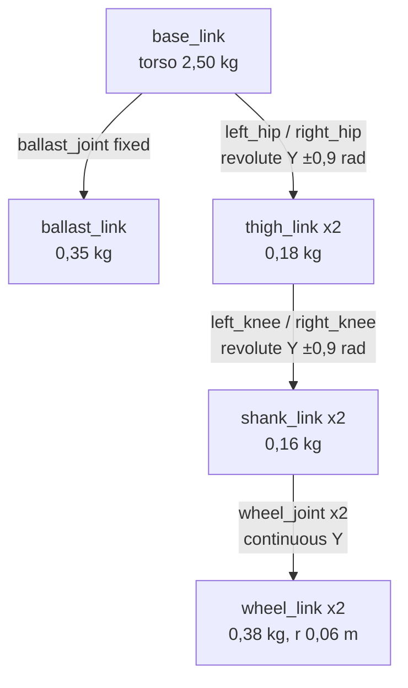
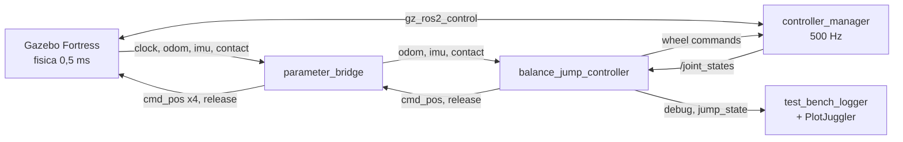
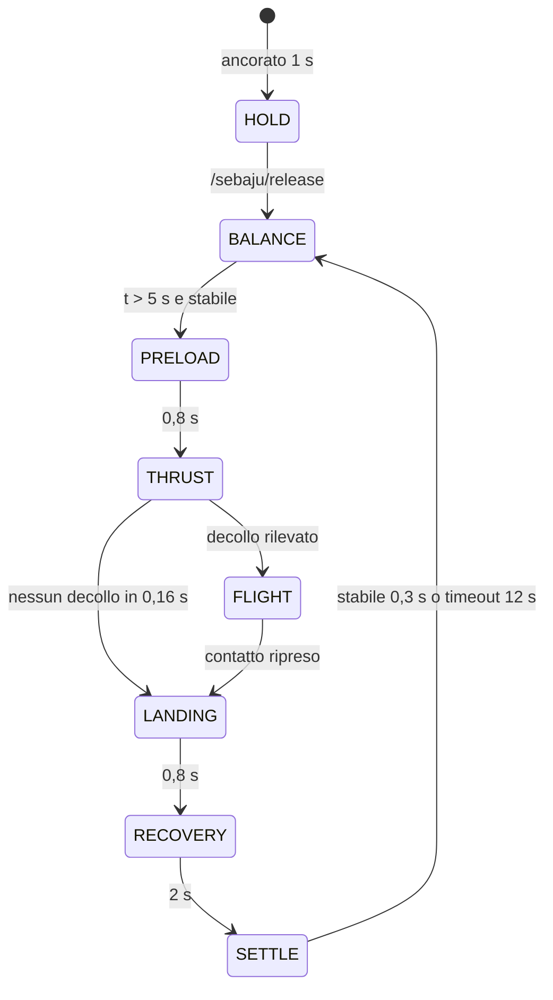

# FSR Robot – Analisi del workspace ROS 2

Aggiornato al 16/09/2026

Il workspace contiene un solo pacchetto, `sebaju_gazebo`: il porting in ROS 2 Humble + Gazebo Fortress di una simulazione MuJoCo di **SeBaJu**, un robot bipede su ruote che si auto-bilancia e salta.

| Area | File | Ruolo |
| --- | --- | --- |
| Modello | `urdf/sebaju.urdf.xacro` (260 righe) | Link, joint, sensori, plugin Gazebo, ros2_control |
| Mondo | `worlds/sebaju_world.sdf` | Suolo, fisica, ancoraggio iniziale del robot |
| Avvio | `launch/sebaju_gazebo.launch.py`, `launch/test_bench.launch.py` | Simulazione completa; simulazione + logger + PlotJuggler |
| Controllo | `balance_jump_controller.py` (832 righe), `kinematics.py`, `planar_trajectory.py` | Bilanciamento, salto, inseguimento traiettoria |
| Telemetria | `test_bench_logger.py`, `config/sebaju_plotjuggler_layout.xml` | CSV in `test_bench_logs/` (62 prove del 16/09) e grafici live |
| Configurazione | `config/sebaju_controllers.yaml`, `scripts/run_controller.sh` | controller_manager a 500 Hz; avvio manuale del controller |

## 1. Modello del robot (URDF)

SeBaJu è un robot con due gambe planari, ognuna terminata da una ruota: 9 link, 8 joint (6 mobili), massa totale 4,29 kg. Il file xacro è una conversione fedele del modello MuJoCo `SeBaJu_BOT(II).xml` (masse, frame e assi coincidono).



Le gambe sono generate da una macro `leg(side, reflect)` che specchia il lato sinistro sul destro.

| Elemento | Valori principali |
| --- | --- |
| Torso (`base_link`) | Box 0,15×0,19×0,11 m, 2,50 kg; zavorra 0,07×0,14×0,036 m, 0,35 kg, spostata avanti e in basso |
| Coscia / tibia | Cilindri da 0,13 m inclinati a ±135°: la coscia va indietro-giù, la tibia avanti-giù, a formare una "V" |
| Geometria in piedi | A giunti a zero l'asse ruota è sotto l'anca: 0,184 m più in basso; torso a 0,244 m da terra |
| Anca / ginocchio | Revolute su Y, limite ±0,9 rad, 60 Nm, smorzamento 0,8 |
| Ruote | Continuous su Y, raggio 0,06 m, limite 18 Nm; iyy include l'armatura MuJoCo (0,002) |
| Attrito | Ruote μ = 2,2; gambe e torso μ = 1,8 (suolo a 2,2 per imitare la regola "max" di MuJoCo) |

Oltre alla cinematica, lo xacro integra quattro blocchi specifici di Gazebo:

- **Sensori:** IMU sul torso (500 Hz, `/sebaju/imu`) e un sensore di contatto per ruota (500 Hz).
- **ros2_control (`gz_ros2_control/GazeboSimSystem`):** interfacce di comando `effort` solo per le ruote (±18 Nm); anche e ginocchia esposte solo come stato (posizione, velocità, sforzo).
- **Servo delle gambe:** 4 plugin `JointPositionController` di Gazebo (anca kp 160 / kv 12, ginocchio kp 200 / kv 14, saturazione ±60 Nm) che riproducono i servo di posizione MuJoCo a ogni passo fisico.
- **Odometria ideale:** `OdometryPublisher` a 500 Hz su `/sebaju/odom` (posa e velocità reali del torso).

Il mondo `sebaju_world.sdf` usa passo fisico 0,5 ms e un modello statico `sebaju_anchor` con `DetachableJoint`: tiene il torso fermo all'avvio finché non arriva un messaggio su `/sebaju/release`.

## 2. Gestione dei topic ROS 2

Tutto passa per topic: il controllo non usa service, action o TF. Gazebo e ROS 2 comunicano tramite un unico `ros_gz_bridge/parameter_bridge`; il nodo di controllo non ha timer e calcola un passo ogni volta che arriva un campione sincronizzato di stato.



| Topic | Tipo | Da → A | Frequenza |
| --- | --- | --- | --- |
| `/clock` | `rosgraph_msgs/Clock` | Gazebo → bridge → tutti (`use_sim_time`) | ogni passo |
| `/joint_states` | `sensor_msgs/JointState` | joint_state_broadcaster → controller, logger, robot_state_publisher | 500 Hz |
| `/sebaju/odom` | `nav_msgs/Odometry` | OdometryPublisher → bridge → controller | 500 Hz |
| `/sebaju/imu` | `sensor_msgs/Imu` | IMU → bridge → controller (solo memorizzato), logger | 500 Hz |
| `/sebaju/left_wheel_contact`, `/sebaju/right_wheel_contact` | `ros_gz_interfaces/Contacts` | Sensori di contatto → bridge (rimappati dal percorso completo Gazebo) → controller, logger | 500 Hz, solo durante il contatto |
| `/wheel_effort_controller/commands` | `std_msgs/Float64MultiArray` [Nm sx, dx] | controller → JointGroupEffortController | per passo |
| `/sebaju/{left,right}_{hip,knee}/cmd_pos` | `std_msgs/Float64` [rad] | controller → bridge → JointPositionController Gazebo | per passo |
| `/sebaju/release` | `std_msgs/Empty` | controller → bridge → DetachableJoint | ripetuto per 50 ms dopo 1 s |
| `/sebaju/jump_state` | `std_msgs/String` | controller → logger | solo ai cambi di stato |
| `/sebaju/debug` | `Float64MultiArray` (11 valori) | controller → logger, PlotJuggler | per passo |
| `/sebaju/planar`, `/sebaju/tracking_error` | `Float64MultiArray` (10 e 2 valori) | controller → PlotJuggler | per passo, solo con `planar_enable` |

Aspetti chiave della gestione:

- **Direzione del bridge:** `[` indica Gazebo → ROS (sensori, clock), `]` ROS → Gazebo (comandi gambe, rilascio).
- **Due vie di attuazione:** le ruote passano da ros2_control (coppia), le gambe bypassano ros2_control e vanno direttamente ai servo di Gazebo via bridge.
- **Sincronizzazione:** `/joint_states` e `/sebaju/odom` arrivano da canali diversi. Il controller li bufferizza (max 50) per timestamp in nanosecondi e usa solo coppie dello stesso passo; altrimenti ripiega sull'ultimo campione di ciascuno, avvisando nel log.
- **Contatti:** il sensore Gazebo pubblica solo mentre tocca, quindi un campione più vecchio di 6 ms vale "forza nulla".
- **QoS:** tutti i publisher e subscriber usano il profilo di default (depth 10, reliable).
- **Avvio in sequenza:** il launch concatena con `OnProcessExit` spawn del robot → joint_state_broadcaster → wheel_effort_controller → balance_jump_controller.

## 3. Principio del sistema di controllo

Il robot è un pendolo inverso su ruote: le ruote tengono il baricentro (CoM) sopra l'asse con una retroazione di stato PD, mentre le gambe, comandate in posizione, cambiano altezza ed eseguono il salto tramite una macchina a stati. Il controllo è in `balance_jump_controller.py` e gira a 500 Hz, al ritmo dei dati di stato.

### 3.1 Stima dello stato

Non c'è filtraggio né fusione sensoriale: lo stato è ricostruito dalla verità di simulazione.

1. Posa del torso da `/sebaju/odom` + angoli dei giunti da `/joint_states`.
2. Cinematica diretta sull'URDF (`kinematics.py`, legge `robot_description`) → posizione di ogni link, CoM totale, centro dell'asse ruote.
3. **θ** = inclinazione del CoM rispetto all'asse, lungo la direzione del robot, al netto dell'offset della posa nominale; **θ̇** per differenza finita.
4. **x, ẋ** = spostamento dell'asse lungo la direzione iniziale e sua derivata; yaw e velocità di yaw dalla posa.
5. Forza normale ruote dai messaggi di contatto, con isteresi (soglie 1,5 N / 6,3 N, debounce 4 / 12 ms) → flag "a terra".

L'IMU viene letto ma non usato nel calcolo.

### 3.2 Legge di bilanciamento (ruote)

Formato codice:

```
u = clamp( Kθ·(θ − θref) + Kθ̇·θ̇ − Kẋ·(ẋ − ẋref) − Kx·(x − xref), ±umax )
coppia_sx = 18 Nm · clamp(−u − u_yaw, ±1)      coppia_dx = 18 Nm · clamp(−u + u_yaw, ±1)
```

Formato matematico:

```math
u = \mathrm{sat}_{u_{\max}}\!\Big( K_\theta\,(\theta - \theta_{ref}) + K_{\dot\theta}\,\dot\theta - K_{\dot x}\,(\dot x - \dot x_{ref}) - K_x\,(x - x_{ref}) \Big)
```

```math
\tau_{sx} = G\,\mathrm{sat}_1\!\big(-u - u_{yaw}\big), \qquad \tau_{dx} = G\,\mathrm{sat}_1\!\big(-u + u_{yaw}\big), \qquad G = 18\ \mathrm{Nm}
```

```math
\mathrm{sat}_a(v) = \min\!\big(a,\ \max(-a,\ v)\big)
```

Il segno meno davanti a $u$ corrisponde a `WHEEL_MOTOR_SIGN = -1` nel codice.

Con θref = 4,73° e umax = 0,35 la coppia di bilanciamento non supera 6,3 Nm per ruota. I guadagni cambiano con la fase del salto:

| Fase | Kθ | Kθ̇ | Kẋ | Kx | umax |
| --- | --- | --- | --- | --- | --- |
| BALANCE | 1,3 | 0,17 | 0,16 | 0,80 | 0,35 |
| PRELOAD | 1,3 | 0,22 | 0,20 | 0,40 | 0,35 |
| THRUST | 1,3 | 0,25 | 0,18 | 0,08 | 0,35 |
| FLIGHT | 1,3 | 0,10 | 0 | 0 | 0,10 |
| LANDING | 1,3 | 0,18 | 0,10 | 0 | 0,22 |
| RECOVERY | 1,3 | 0,20 | 0,12 | 0,16 | 0,28 |
| SETTLE | 1,3 | 0,17 | 0,22 | 0,12 | 0,35 |

### 3.3 Supervisore del salto (gambe)



In ogni fase le gambe ricevono angoli obiettivo interpolati (smoothstep) che i servo di Gazebo inseguono con PD saturato a 60 Nm.

| Fase | Anca [rad] | Ginocchio [rad] | Effetto |
| --- | --- | --- | --- |
| PRELOAD | +0,12 | −0,22 | Accovacciamento in 0,8 s |
| THRUST | −0,27 | +0,44 | Estensione rapida in 20 ms |
| FLIGHT | angoli al decollo | angoli al decollo | Gambe bloccate in volo |
| LANDING | +0,08 | −0,20 | Ammortizzazione in 0,8 s |
| RECOVERY → SETTLE | 0 | 0 | Ritorno alla posa in piedi |

Il decollo richiede quattro condizioni insieme: flag "a terra" falso, forza sotto soglia, ruote sollevate (> 0,5 mm assoluti e > 3 mm relativi) e velocità verticale del CoM > 0,08 m/s. A fine salto il nodo stampa un riepilogo (altezza, tempo di volo, saturazioni, tempo di assestamento).

### 3.4 Modalità di movimento (senza salto)

- **Drive** (`drive_enable`): riferimento cosinusoidale avanti-indietro su x, 1 m in 8 s.
- **Planar** (`planar_enable`): curva a S cubica di 3 m con scostamento laterale 0,6 m, legge oraria quintica in 12 s (`planar_trajectory.py`). L'errore lungo la traiettoria entra nella legge PD; heading ed errore laterale producono una coppia differenziale `u_yaw` (Kψ 0,10, Kω 0,025, max 0,15), attenuata vicino a velocità nulla.

## 4. Valutazioni aggiuntive

L'architettura è pulita e fedele al modello MuJoCo, ma le prove recenti indicano un problema di esecuzione: più istanze del controller attive insieme. In più, il controllo dipende da dati ideali che su un robot reale non esistono.

### 4.1 Cosa dicono i log (62 CSV del 16/09)

| Prova | Righe/s | Tempo non monotono | Esito |
| --- | --- | --- | --- |
| 18:59:31, 18:52:05, 18:48:11, 18:42:12, 18:39:55 | — | — | CSV vuoti (solo intestazione) |
| 18:50:12 | 1 844 | 5 salti indietro, fino a 6 righe per istante | Caduta (θ > 30°) a t = 4,5 s |
| 18:37:57 | 2 205 | 9 salti indietro, fino a 9 righe per istante | Caduta a t = 2,1 s, ruote in saturazione per 13 182 righe |
| 18:18:41 | 500 | nessuno | Stabile per 120 s, θ max 6,5°, x finale 2,94 m |
| 17:18:30 | — | — | Fuga: x finale 1 153 m, saturazione continua |

Il logger dovrebbe scrivere 500 righe al secondo. Valori di 1 800–2 200 righe/s con tempi che ripartono da zero indicano che più nodi `balance_jump_controller` pubblicavano su `/sebaju/debug`, e quindi anche sulle coppie delle ruote. È la causa più probabile delle cadute. L'unica prova pulita (500 righe/s) è anche l'unica stabile.

### 4.2 Criticità e raccomandazioni

| Priorità | Criticità | Raccomandazione |
| --- | --- | --- |
| Alta | Controller duplicati (launch + `run_controller.sh`, o processi rimasti da prove precedenti) | Prima di ogni prova: `ros2 node list`, e chiudere i processi residui (`pkill -f balance_jump_controller`, `pkill -f "ign gazebo"`); all'avvio il nodo potrebbe rifiutarsi di partire se ne trova un altro con lo stesso nome |
| Alta | Nessun watchdog: se i dati si fermano, `JointGroupEffortController` mantiene l'ultima coppia inviata | Azzerare le coppie se non arrivano stati per > 10 ms; spegnere i motori se θ supera ~30° |
| Alta (per il reale) | Stato da odometria ideale di Gazebo; IMU sottoscritto ma non usato; derivate senza filtro | Stimatore con IMU + encoder (filtro complementare o Kalman), poi test in simulazione con rumore e ritardi sull'IMU |
| Media | Gambe fuori da ros2_control (servo Gazebo via bridge): due percorsi di attuazione diversi | Portare anche e ginocchia in ros2_control (interfaccia position o effort con PD), così il passaggio all'hardware cambia solo il plugin |
| Media | Guadagni e soglie sono costanti Python, e kp/kv/raggio ruota/rapporto 18 sono duplicati tra xacro e codice | Esporli come parametri ROS in un YAML; leggere dall'URDF i valori già presenti |
| Media | La "forza normale" è il modulo della forza di contatto (attrito incluso); se manca il wrench si assume metà peso per ruota | Usare la componente lungo la normale di contatto |
| Bassa | Il logger considera scaduto un contatto dopo 20 ms, il controller dopo 6 ms: `fn_left/right` nel CSV non sommano a `fn_total` | Allineare la costante, o pubblicare le forze per lato in `/sebaju/debug` |
| Bassa | `/sebaju/planar` e `/sebaju/tracking_error` non finiscono nel CSV | Aggiungere le colonne al logger |
| Bassa | `/sebaju/odom_tf` non è nel bridge: in RViz manca world → base_link | Aggiungerlo al bridge rimappato su `/tf` |
| Bassa | `np.trapz` è deprecato in NumPy 2; nel pacchetto ci sono bytecode sia Python 3.10 sia 3.13 | Usare `np.trapezoid` con fallback; verificare che tutto giri nel Python 3.10 di Humble |
| Bassa | `run_controller.sh` non installato da `setup.py`; licenza "TODO"; nessun test né README; workspace non sotto git | Installare lo script, scegliere una licenza, aggiungere test su cinematica e traiettoria, inizializzare git |

### 4.3 Punti di forza

- Porting MuJoCo → Gazebo documentato in modo accurato (attrito min/max di DART, armatura ruote, parent del giunto di ancoraggio).
- Sincronizzazione esplicita per timestamp tra `/joint_states` e odometria, con passo fisico 0,5 ms e controllo 500 Hz.
- Rilevamento di decollo e atterraggio robusto, con isteresi e condizioni ridondanti.
- Banco prova completo: CSV per ogni esecuzione e layout PlotJuggler già pronto.

## 5. Comandi per lanciare la simulazione

Ci sono tre modi per avviare la simulazione: `sebaju_gazebo.launch.py` (solo simulazione), `test_bench.launch.py` (simulazione + logger CSV + PlotJuggler) e l'avvio separato del controller con `run_controller.sh`.

### 5.1 Compilazione e ambiente

Il progetto ha due workspace con lo stesso pacchetto `sebaju_gazebo`: `~/FSR_robot/PID` (controllore attuale) e `~/FSR_robot/MPC` (controllore del paper Cui et al. 2022: TV-LQR + MPC + VMC + Kalman, nodo `wbr_controller`; comandi e argomenti in `MPC/docs/Adattamento_paper_WBR.md`, sezione 7). Ognuno salva i CSV nella propria cartella `test_bench_logs/`. In un terminale fai il `source` di **un solo** workspace: con entrambi, l'ultimo caricato nasconde l'altro.

Da ripetere in ogni nuovo terminale (il `source`) e dopo ogni modifica ai file (la build). Sostituisci `PID` con `MPC` per l'altro workspace:

```bash
source /opt/ros/humble/setup.bash
cd ~/FSR_robot/PID
colcon build --packages-select sebaju_gazebo --symlink-install
source install/setup.bash
```

Se `ros2` segnala `No module named 'rclpy._rclpy_pybind11'`, è attivo il Python 3.13 di miniconda: esegui `conda deactivate` prima dei comandi.

Con `--symlink-install` le modifiche ai file Python non richiedono una nuova build. Launch, xacro e YAML vanno comunque ricompilati se aggiungi file nuovi.

### 5.2 Pulizia prima di ogni prova

Evita i controller duplicati visti nei log (sezione 4.1):

```bash
pkill -f balance_jump_controller; pkill -f test_bench_logger
pkill -f "ign gazebo"; pkill -f parameter_bridge; pkill -f robot_state_publisher
ros2 daemon stop && ros2 daemon start
ros2 node list          # deve risultare vuoto
```

### 5.3 Argomenti di lancio

| Argomento | Default | Significato | Launch |
| --- | --- | --- | --- |
| `gui` | `true` | Apre la GUI di Gazebo (`false` = solo server, `-s`) | entrambi |
| `jump_enable` | `true` | Esegue il salto verticale | entrambi |
| `jump_start_time` | `5.0` | Secondi dopo il rilascio prima del salto | entrambi |
| `drive_enable` | `false` | Avanti-indietro in bilanciamento (usare con `jump_enable:=false`) | entrambi |
| `drive_distance` | `1.0` | Corsa avanti-indietro [m] | entrambi |
| `drive_period` | `8.0` | Durata di un ciclo [s] | entrambi |
| `planar_enable` | `false` | Traiettoria planare a S (usare con `jump_enable:=false`) | entrambi |
| `traj_length` | `3.0` | Lunghezza della traiettoria [m] | entrambi |
| `traj_lateral` | `0.6` | Scostamento laterale della S [m] | entrambi |
| `traj_duration` | `12.0` | Durata della traiettoria [s] | entrambi |
| `start_controller` | `true` | `false` = il controller va avviato a mano | entrambi |
| `output_dir` | `<workspace>/test_bench_logs` (es. `~/FSR_robot/PID/test_bench_logs`) | Cartella dei CSV | solo `test_bench` |
| `start_plotjuggler` | `true` | Apre PlotJuggler | solo `test_bench` |

Per vedere l'elenco aggiornato direttamente da ROS:

```bash
ros2 launch sebaju_gazebo sebaju_gazebo.launch.py --show-args
ros2 launch sebaju_gazebo test_bench.launch.py --show-args
```

### 5.4 Simulazione semplice (`sebaju_gazebo.launch.py`)

```bash
# Default: bilanciamento + salto dopo 5 s, con GUI
ros2 launch sebaju_gazebo sebaju_gazebo.launch.py

# Senza GUI (più veloce)
ros2 launch sebaju_gazebo sebaju_gazebo.launch.py gui:=false

# Salto anticipato a 2 s
ros2 launch sebaju_gazebo sebaju_gazebo.launch.py jump_start_time:=2.0

# Solo bilanciamento da fermo
ros2 launch sebaju_gazebo sebaju_gazebo.launch.py jump_enable:=false

# Avanti-indietro (valori di default: 1 m in 8 s)
ros2 launch sebaju_gazebo sebaju_gazebo.launch.py jump_enable:=false drive_enable:=true

# Avanti-indietro personalizzato: 2 m in 10 s
ros2 launch sebaju_gazebo sebaju_gazebo.launch.py jump_enable:=false drive_enable:=true \
  drive_distance:=2.0 drive_period:=10.0

# Traiettoria planare a S (valori di default: 3 m, 0,6 m laterali, 12 s)
ros2 launch sebaju_gazebo sebaju_gazebo.launch.py jump_enable:=false planar_enable:=true

# Traiettoria planare personalizzata
ros2 launch sebaju_gazebo sebaju_gazebo.launch.py jump_enable:=false planar_enable:=true \
  traj_length:=4.0 traj_lateral:=1.0 traj_duration:=16.0
```

Con `drive_enable` e `planar_enable` entrambi attivi prevale la traiettoria planare, che sovrascrive l'errore di posizione.

### 5.5 Banco prova (`test_bench.launch.py`)

Accetta tutti gli argomenti della 5.4, più `output_dir` e `start_plotjuggler`. Richiede PlotJuggler (`sudo apt install ros-humble-plotjuggler-ros`). All'apertura PlotJuggler chiede di confermare "Start Streaming?".

```bash
# Salto con CSV e PlotJuggler
ros2 launch sebaju_gazebo test_bench.launch.py

# Solo CSV, senza PlotJuggler né GUI Gazebo
ros2 launch sebaju_gazebo test_bench.launch.py gui:=false start_plotjuggler:=false

# Traiettoria planare con log in una cartella dedicata
ros2 launch sebaju_gazebo test_bench.launch.py jump_enable:=false planar_enable:=true \
  output_dir:=$HOME/FSR_robot/PID/test_bench_logs/planar

# Avanti-indietro con log
ros2 launch sebaju_gazebo test_bench.launch.py jump_enable:=false drive_enable:=true
```

### 5.6 Controller avviato a mano (`run_controller.sh`)

Utile per riavviare solo il controller senza riaprire Gazebo. Lo script non viene installato da `setup.py`, quindi va lanciato dalla cartella sorgente. **Usarlo solo con `start_controller:=false`**, altrimenti girano due controller insieme.

```bash
# Terminale 1: Gazebo, bridge e ros2_control, senza controller
ros2 launch sebaju_gazebo sebaju_gazebo.launch.py start_controller:=false
#   oppure con logger e PlotJuggler:
ros2 launch sebaju_gazebo test_bench.launch.py start_controller:=false

# Terminale 2: controller con i parametri di default del nodo
~/FSR_robot/PID/src/sebaju_gazebo/scripts/run_controller.sh

# Terminale 2: con parametri personalizzati
~/FSR_robot/PID/src/sebaju_gazebo/scripts/run_controller.sh -p jump_enable:=false -p planar_enable:=true
~/FSR_robot/PID/src/sebaju_gazebo/scripts/run_controller.sh -p jump_start_time:=3.0 -p return_to_start_after_jump:=true
~/FSR_robot/PID/src/sebaju_gazebo/scripts/run_controller.sh -p jump_enable:=false -p drive_enable:=true -p drive_start_time:=4.0
```

Due parametri esistono solo nel nodo e si impostano solo così: `return_to_start_after_jump` (default `false`, dopo l'atterraggio torna a x = 0) e `drive_start_time` (default `2.0` s).

Il robot resta agganciato all'ancora finché il controller non pubblica `/sebaju/release`. Per ripetere una prova bisogna quindi riavviare anche Gazebo (terminale 1).

### 5.7 Monitoraggio durante la prova

```bash
ros2 node list                                      # un solo /sebaju_balance_jump_controller
ros2 topic hz /sebaju/debug                          # atteso ~500 Hz
ros2 topic echo /sebaju/jump_state                   # fasi del salto
ros2 topic echo /wheel_effort_controller/commands    # coppie ruote [Nm]
ros2 control list_controllers                        # joint_state_broadcaster e wheel_effort_controller attivi
ros2 run plotjuggler plotjuggler                     # poi trascina il CSV da test_bench_logs/
```
