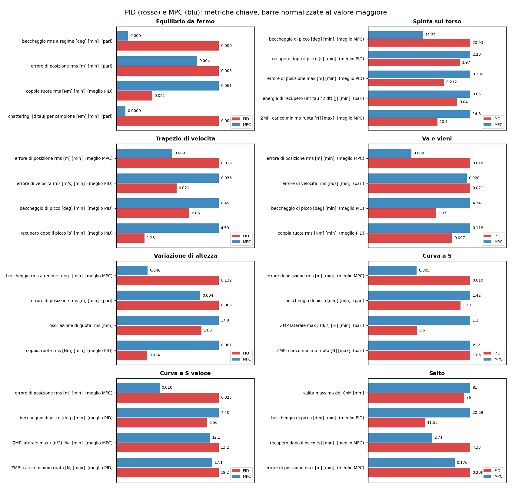
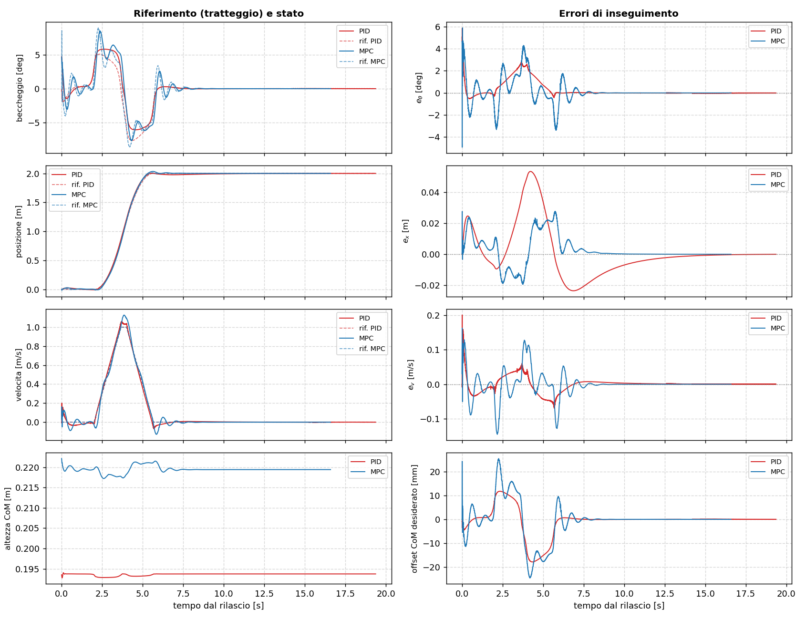
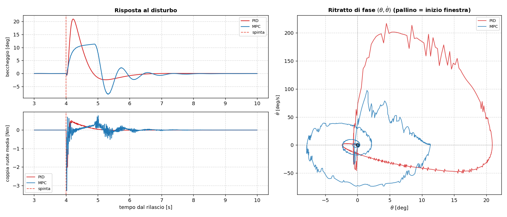

# Confronto PID – MPC

Documento sintetico, 01/10/2026. Riporta i risultati della suite di benchmark (`ros2 run rotino_benchmark suite`) con le due leggi del progetto: il **PID con lo ZMP** (`rotino_pid`, `PID_ZMP.md`) e l'**MPC + TV-LQR + VMC** (`rotino_mpc`, `Tecniche_di_controllo.md` §4).

**Condizioni.** Stesso mondo, URDF e attuazione in coppia a 500 Hz, e stessi argomenti di scenario: cambia solo il controllore. Una differenza resta: il PID legge posa e velocità dalla ground truth del simulatore, l'MPC dall'IMU con un filtro di Kalman.

I dati completi sono in `benchmark_runs/suite_pid_mpc/`, cartella non versionata: `riepilogo.md` e, per ogni scenario, `confronto.md` con la tabella intera e 12 grafici sovrapposti.

## Come si legge

- Ogni metrica ha un verso: minore o maggiore è meglio, oppure è solo descrittiva.
- "Migliore" indica la legge in vantaggio. "Pari" vale sotto il 5 % di differenza o sotto la risoluzione della metrica, per esempio 0,05° di beccheggio o 3 mm di posizione.
- Picco, recupero ed energia di recupero ignorano il primo 1,5 s dopo il rilascio dall'ancora, un transitorio identico per le due leggi.



## Bilancio

Su 31 metriche chiave in 8 scenari: **PID migliore in 12, MPC migliore in 10, pari in 9.**

| Scenario | Dove vince il PID | Dove vince l'MPC |
|---|---|---|
| Equilibrio da fermo | coppia ruote rms 0,021 contro 0,061 Nm | — (beccheggio, posizione e chattering pari) |
| Spinta 2,7 N·s | recupero 1,97 contro 2,20 s; deriva max 0,21 contro 0,29 m | picco 11,3° contro 20,9°; carico minimo ruota 14,8 contro 10,1 N |
| Trapezio 1 m/s | picco 6,1° contro 8,5°; recupero 1,3 contro 4,6 s; errore di velocità 0,021 contro 0,036 m/s | errore di posizione 9 contro 16 mm rms |
| Va e vieni | picco 2,9° contro 4,3°; coppia 0,097 contro 0,118 Nm | errore di posizione 8 contro 18 mm rms |
| Variazione di altezza | coppia 0,024 contro 0,081 Nm | beccheggio rms 0,04° contro 0,13° |
| Curva a S | — | errore di posizione 5 contro 10 mm rms (picco e ZMP pari) |
| Curva a S veloce | picco 6,6° contro 7,4°; carico minimo 18,2 contro 17,1 N | errore di posizione 10 contro 25 mm rms; ZMP laterale 12,1 contro 13,2 % |
| Salto | picco 11,5° contro 20,7° | recupero 2,7 contro 4,3 s; deriva max 0,18 contro 0,21 m |

## Che cosa dicono i numeri

1. **L'MPC segue meglio la posizione.**
   - In tutti i moti pianificati il suo errore di posizione è da 1,8 a 2,5 volte più basso.
   - Pianifica il baricentro su un orizzonte di 0,5 s e l'LQR insegue quel piano.
   - Il PID corregge la posizione solo attraverso il Capture Point, con autorità ridotta ($\rho = 0{,}4$, `PID_ZMP.md` §3). È la scelta che ne garantisce lo smorzamento, ma lascia qualche centimetro di ritardo sul percorso.
2. **Il PID è più dolce.**
   - Chiede meno coppia in tutti gli scenari: da 1,1 a 3,3 volte meno, e 7,9 volte meno nel salto.
   - Si inclina meno nei moti pianificati: la sua anteprima LIPM distribuisce l'inclinazione prima e dopo i gradini di accelerazione.
   - Nel trapezio si assesta in 1,3 s contro 4,6 s: l'MPC oscilla attorno al riferimento di beccheggio (figura sotto).
3. **Sulle spinte l'MPC contiene meglio l'inclinazione.**
   - L'MPC arriva a 11,3° contro i 20,9° del PID e lascia più carico sulla ruota scarica.
   - Il PID però recupera prima e deriva meno.
   - Il picco del PID dipende dall'autorità ridotta e dal limite di accelerazione ($a_{max}$ = 3 m/s²): è il prezzo della robustezza scelta in progetto.
4. **Nel salto il PID resta più composto** (11,5° contro 20,7° di picco), mentre l'MPC si riassesta prima.
5. **Sullo ZMP le due leggi sono equivalenti.** Nella S veloce usano il 12–13 % del semi-appoggio e lasciano almeno 17 N sulla ruota scarica. La differenza di un punto percentuale è dell'ordine della variabilità fra due esecuzioni: il 30/09 l'MPC aveva fatto 16 %.





## Limiti

- **Una sola esecuzione per scenario.** Differenze di pochi punti percentuali sono dentro la variabilità da prova a prova. Per statistiche serve ripetere la suite.
- **Misure diverse.** Il PID usa la ground truth, l'MPC la stima IMU + Kalman. Il vantaggio del PID su chattering e coppia ne beneficia in parte.
- **Nessun disturbo persistente nel catalogo.** Il PID ha un integrale sul Capture Point, l'LQR/MPC no (`Tecniche_di_controllo.md` §4). Uno scenario con forza costante sul torso metterebbe in luce la differenza; `campaign -- --scenario ...` permette di provarlo.

## Riprodurre

```bash
colcon build --symlink-install && source install/setup.zsh
ros2 run rotino_benchmark suite                      # circa 25 min: 8 scenari x 2 leggi + analisi
ros2 run rotino_benchmark suite -- --list            # gli scenari
ros2 run rotino_benchmark campaign -- trapezio       # un solo scenario
ros2 run rotino_benchmark compare -- benchmark_runs/suite_<data>   # ricostruisce tabelle e grafici
```
