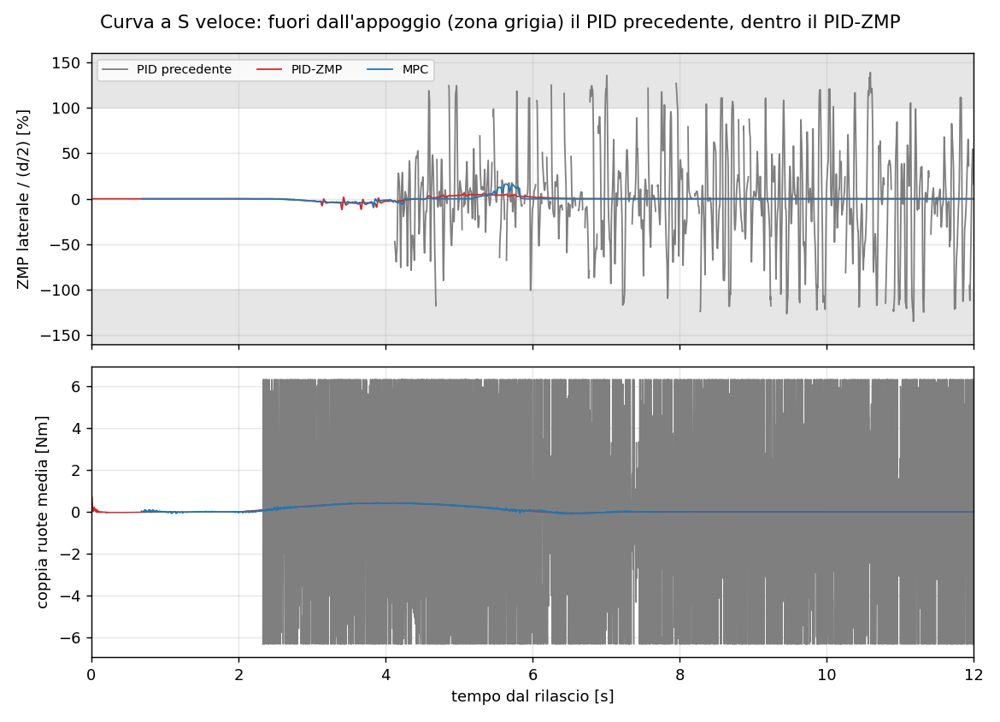
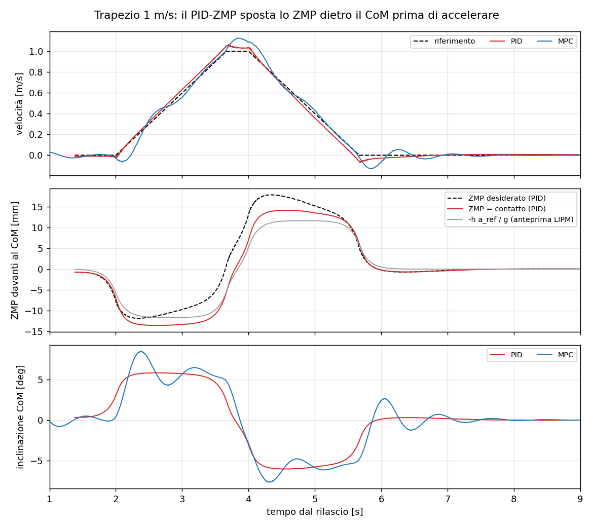
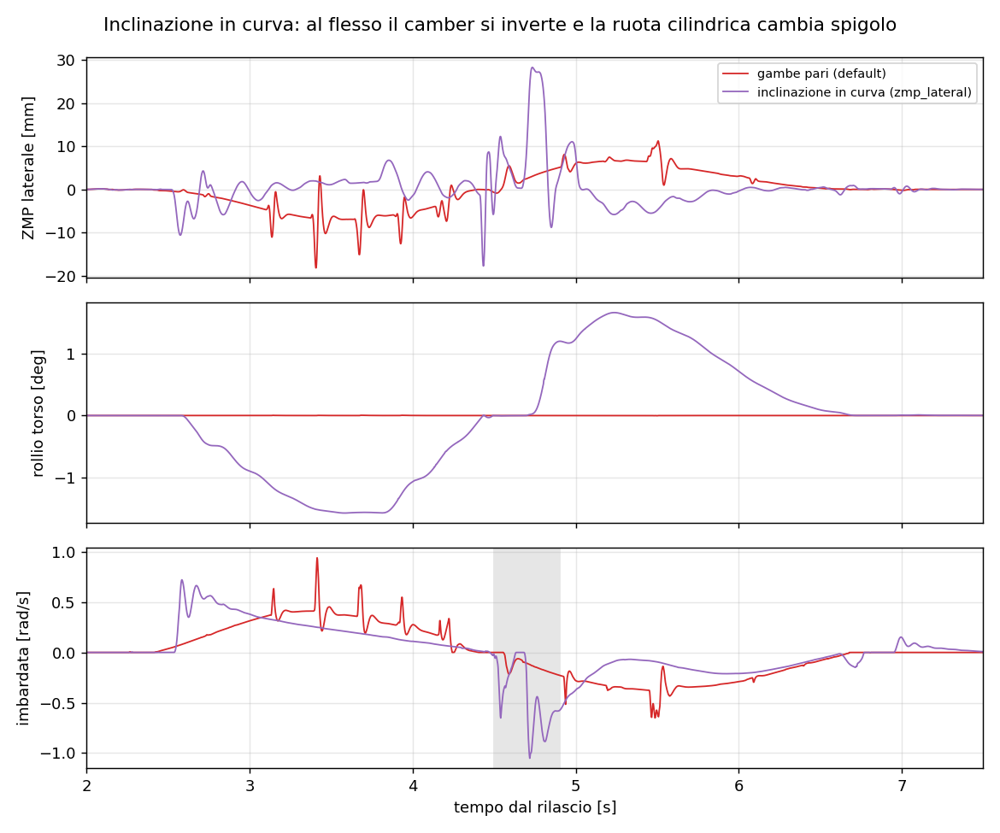

# PID di RoTino con lo ZMP nel controllo

Documento sintetico, 01/10/2026. Descrive come è stato riprogettato il controllore `rotino_pid`, perché lo Zero Moment Point è diventato la sua variabile di equilibrio e che cosa è cambiato nelle campagne in Gazebo. Segue `Studio_ZMP.md`, che aveva misurato il problema.

---

## 1. Da dove si partiva

Lo studio ZMP del 30/09 mostrava che il PID era l'unica legge a non rispettare il criterio ZMP:
- lo ZMP laterale usciva dal segmento di appoggio (fino al 143 % del semi-appoggio);
- le ruote si scaricavano completamente (carico minimo 0 N);
- la coppia alle ruote saltava tra ±6,3 Nm a ogni campione (chattering di 4,6 Nm per campione).

Analizzando il codice sono emerse quattro cause e un problema di misura:

| Problema | Effetto |
|---|---|
| **Gambe con un PD di giunto da 160–200 Nm/rad** portato da 2 kHz (servo interno di Gazebo) a 500 Hz nel nodo | Ciclo limite bang-bang delle gambe (`diagnostics/06_diagnosi.txt`): è la vibrazione che scaricava le ruote. |
| **Guadagni delle ruote** tarati in MuJoCo con gambe rigide | Retroazione di stato non adatta alla pianta reale. |
| **Mancavano gli scenari `push_enable` e `velocity_enable`** | Nelle campagne "spinta" e "trapezio" di ieri il PID stava solo in equilibrio sul posto: quei confronti non erano validi. |
| **Contatti sottoscritti con coda 10** | Il sensore pubblica a circa 2 kHz: i messaggi arrivavano già vecchi fino a 5 ms, e il robot risultava "senza contatto" dal 30 all'80 % del tempo. |
| Beccheggio registrato con un **offset fisso di 4,73°** (`PITCH_OFFSET`) | Gonfiava le metriche di beccheggio. Ora si registra l'inclinazione del CoM dalla verticale, come per l'MPC. |

## 2. L'idea: lo ZMP come ingresso di controllo

Su un robot a due ruote il poligono di appoggio degenera nel segmento fra i contatti.
- **Longitudinalmente** lo ZMP non ha spazio per muoversi: sta sulla linea dei contatti, e sono le ruote a decidere dove si trova quella linea. Lo ZMP è quindi la leva con cui si governa il CoM. È il modello *cart-table* del LIPM (Kajita 2003):

  ```
  c̈ = ω² (c − p),   ω² = g / h        c = CoM, p = ZMP (= contatto), h = altezza del CoM
  ```

- **Lateralmente** lo ZMP può muoversi lungo il segmento e ci deve restare dentro. In curva si sposta verso la ruota esterna di h·a_y/g.

## 3. Architettura

```
 traiettoria ──► anteprima LIPM ──► c_ref, c̈_ref ──┐
 (S, trapezio,     (nucleo e^-ω|u|)                 │
  va e vieni)                                       ▼
 CoM, contatto ─► errore Capture Point ──► PI DCM ──► ZMP desiderato ──► PD sull'offset ZMP ──► coppia comune ruote
 (odom + FK)      ξ = c + ċ/ω              (ρ = 0,4)   p_des = c − s_des     + feedforward di modello
                                                                                                     ├──► τ_L, τ_R
 rotta ─────────► PID imbardata + feedforward d'attrito (Coulomb + viscoso) ──► coppia differenziale ──┘

 gambe: PD cartesiano ruota→anca (1500 / 5000 N/m) + peso in feedforward; salto: stesse traiettorie di giunto, convertite
```

**Anello esterno: PI sul Capture Point (DCM).** ξ = c + ċ/ω diverge con ξ̇ = ω(ξ − p). Imponendo ξ̇ = ξ̇_ref − k_ξ e_ξ − k_i ∫e_ξ si ottiene lo ZMP che serve:
```
s_des = c − p_des = s_ff − ρ [ ė_c/ω + (k_ξ/ω) e_ξ + (k_i/ω) ∫e_ξ ]        (limitato a a_max/ω²)
```
dove s è l'offset del CoM davanti all'asse, cioè la distanza fra CoM e ZMP.

**Anello interno: PD sull'offset ZMP.**
```
τ = τ_ff + K_s (s − s_des) + K_sd (ṡ − ṡ_ff)
```
Il feedforward (s_ff, τ_ff) è l'inclinazione e la coppia che mantengono l'accelerazione di riferimento a regime, ricavate dal modello VL-WIP condiviso (`rotino_description/model.py`).

**Anteprima LIPM.** Un pendolo inverso è a fase non minima: per accelerare in avanti il contatto deve prima arretrare sotto un CoM già inclinato in avanti. Il riferimento del CoM è quindi la soluzione limitata di c̈ = ω²(c − p_ref), dove p_ref è il percorso pianificato delle ruote. Si ottiene filtrando il percorso con il nucleo simmetrico (ω/2)·e^(−ω|u|): il robot **si inclina prima** del gradino di accelerazione (figura 1, circa 0,2 s prima del via).

**Perché ρ = 0,4 e non 1.** La cascata LIPM "pura" presuppone un anello interno infinitamente veloce. Qui non lo è: il modo pendolo-ruote è circa 10 rad/s e ci sono fino a 2 campioni di ritardo a 500 Hz. Con autorità piena il termine ċ/ω diventa una retroazione positiva sulla velocità delle ruote e la cascata è instabile per ogni K_s abbastanza alto. Con ρ = 0,4 l'errore residuo lo recupera l'integrale.

**Gambe.** PD cartesiano sulla posizione della ruota rispetto all'anca, con il peso in feedforward. In spazio giunti equivale a circa 50 Nm/rad e circa 1 Nm·s/rad: un passo da 2 ms non può più scavalcare l'inerzia riflessa della gamba, e il ciclo limite sparisce. Il salto usa le stesse traiettorie di giunto di prima, convertite in punti cartesiani, con guadagni più alti.

## 4. Progetto dei guadagni

I guadagni sono stati scelti **sul modello linearizzato**, discretizzato a 500 Hz con 1–2 campioni di ritardo, prima di passare a Gazebo. La scelta è per posizionamento robusto dei poli, su dieci casi: massa ±20 %, CoM da accosciato a esteso (anca ±0,3 rad), ritardo 1 o 2 campioni.

| Parametro | Valore |
|---|---|
| K_s, K_sd (anello interno, per ruota) | 60 Nm/m, 5 Nm·s/m |
| ρ, k_ξ, k_i (DCM) | 0,4 · 1,5 s⁻¹ · 0,5 s⁻² |
| a_max (limite dello ZMP desiderato) | 3 m/s², cioè offset ≤ 59 mm |
| Gambe in appoggio | 1500 / 5000 N/m, 40 / 80 N·s/m |
| Imbardata | 1,8 Nm/rad, 0,45 Nm·s/rad, I 0,6 Nm/(rad·s); attrito 0,25 Nm + 0,10 Nm·s/rad |

Poli nominali ad anello chiuso: −0,5; −2,3 ± 0,2j; −9,8; −52 s⁻¹. **Smorzamento minimo 0,69** su tutti i casi di robustezza.

**Test offline.** `src/rotino_pid/test/test_zmp_balance.py` contiene 16 test. Sul modello lineare la legge:
- insegue il trapezio della campagna con meno di 1 cm di errore;
- respinge la spinta da 2,7 N·s;
- toglie con l'integrale un offset del CoM che il modello non conosce;
- resta stabile in tutti i casi di robustezza.

## 5. Risultati in Gazebo

Condizioni identiche allo studio ZMP: Gazebo headless, 500 Hz, stessi argomenti e durate. L'MPC è quello delle campagne del 30/09 (codice invariato). Il confronto completo e aggiornato PID–MPC, su otto scenari, è in `Confronto_PID_MPC.md`.

**Prima e dopo, curva a S veloce** (`traj_duration:=5.0 traj_lateral:=1.0`):

| Metrica | PID precedente | **PID-ZMP** |
|---|---|---|
| ZMP laterale max / (d/2) | 139 % (fuori appoggio) | **11,8 %** |
| Carico minimo sulla ruota più scarica | 0 N | **18,5 N** |
| Beccheggio di picco | 20,5° | **6,6°** |
| Coppia ruote rms | 5,20 Nm | **0,17 Nm** |
| Chattering (Δτ per campione) | 4,62 Nm | **0,0000 Nm** |
| Tempo "senza contatto" | 80 % | **0,1 %** |
| Residuo longitudinale ZMP rms | 17,7 mm | **0,41 mm** |
| Utilizzo massimo dell'attrito | 42 % | **4,4 %** |



**Confronto con l'MPC** (PID / MPC; in grassetto il migliore):

| Campagna | Beccheggio di picco [°] | Recupero [s] | Altre metriche |
|---|---|---|---|
| S veloce | **6,6** / 7,2 | **1,1** / 1,7 | ZMP laterale max **11,8** / 16,2 %; carico minimo **18,5** / 17,4 N |
| Trapezio 1 m/s | **6,1** / 8,5 | **1,3** / 4,6 | velocità di picco (rif. 1,0) **1,06** / 1,13 m/s |
| Spinta 2,7 N·s | 20,9 / **11,3** | **2,0** / 2,2 | carico minimo 10,0 / **16,0** N |
| S lenta | 4,7 / **2,8** | 13,5 / 13,1 | errore di beccheggio rms 0,60 / **0,33**° |



**Come si leggono i risultati:**
- **Il PID ora rispetta il criterio ZMP in tutte le campagne:** carico minimo sulla ruota ≥ 10 N, zero campioni con ruote scariche.
- **Con i riferimenti pianificati il PID è il più preciso.** Nel trapezio lo ZMP effettivo segue quello desiderato e l'inclinazione è l'unica delle tre senza sovraelongazioni. È l'effetto dell'anteprima LIPM.
- **Sulle perturbazioni impreviste l'MPC resta migliore.** Il PID recupera la spinta in 2 s come l'MPC, ma si inclina di 20,9° contro 11,3°. L'autorità ridotta ρ = 0,4 e il limite a_max ne sono il prezzo. Si potrebbe aumentare ρ solo durante i transitori.
- **Il salto funziona ancora:** volo di 0,23 s, CoM 5,2 cm più in alto in aria, ruote a 4,3 cm dal suolo, assestamento in 4,1 s, nessuna saturazione.
- **Costo di calcolo:** circa 0,45 ms per passo, di cui 0,25 ms per lo stimatore ZMP multicorpo. Il nodo tiene i 481 Hz di odom.

## 6. Compensazione laterale: implementata, disattivata di default

`zmp_lateral:=true` inclina il torso in curva: accorcia la gamba interna e allunga quella esterna, per portare il CoM verso l'interno di h·a_y/g e tenere lo ZMP al centro.
- La mappa geometrica viene dalla cinematica dell'URDF: 0,656 mm di spostamento del CoM per ogni mm di differenza fra le gambe, cioè braccio h. Ne segue sin φ = a_y/g, l'inclinazione di una bicicletta.
- Il comando usa la **stessa anteprima LIPM** del piano sagittale, applicata a h·a_y/g lungo la curva pianificata.
- Un integrale sul rollio misurato recupera la cedevolezza delle gambe sotto il trasferimento di carico: senza, arrivava solo il 20 % dell'inclinazione comandata.

**Esito** (S veloce, due prove coperte per intero, gambe pari → inclinazione):

| Tratto | Offset medio ZMP laterale | rms | max \|·\| |
|---|---|---|---|
| Primo lobo (2,5–4,3 s) | −4,6 → **+0,2 mm** | 5,6 → **2,9 mm** | 18,2 → **10,6 mm** |
| Flesso (4,4–4,9 s) | +2,3 → +6,7 mm | 3,0 → 13,3 mm | 5,5 → **28,2 mm** |
| Secondo lobo (4,9–6,7 s) | +3,9 → **−0,8 mm** | 4,7 → **3,2 mm** | 11,2 → 11,0 mm |
| Intera prova | | 2,6 → 2,8 mm | 12,3 → 19,2 % di d/2 |

**Nei lobi della curva la compensazione fa quello per cui è progettata:** lo ZMP torna al centro. **Al flesso invece nasce un picco** che fa peggiorare il massimo dell'intera prova.

La causa è misurata nei contatti di Gazebo. **La ruota è un cilindro rigido largo 56 mm:** appena il torso si inclina va in camber e appoggia sullo spigolo, a 27,7 mm dal piano medio. Al flesso della S il camber si inverte e il contatto salta sull'altro spigolo (−27…−28 mm): 55 mm in un istante. La coppia di strisciamento cambia di colpo e l'imbardata dà uno scatto (−1,1 rad/s), che sposta lo ZMP di circa 28 mm (figura 3). Lo stesso succede, più in piccolo, quando l'inclinazione comincia (circa 2,6 s).



Per questo `zmp_lateral` è `false` di default. Per sfruttarla serve una collisione di ruota bombata (toro o cilindro con bordi sferici). È una modifica dell'URDF comune alle tre leggi, da decidere a parte.

**Due tentativi scartati, con la misura:**
- La correzione proporzionale sullo ZMP laterale *misurato* (guadagno 0,3) ha innescato un ciclo limite di ±175 mm. Inclinare il torso sposta prima lo ZMP nel verso sbagliato (fase non minima) e lo stimatore ha 25 ms di ritardo.
- Un termine proporzionale sul rollio (2,0) eccitava un modo di rollio a 5 Hz. Anche 0,4° a 5 Hz scuotono lo ZMP di ±40 mm.

Nota per tutte le leggi: anche con le gambe pari il contatto di Gazebo finisce talvolta sullo spigolo. Lo ZMP laterale ricostruito, che assume ruote sottili, ha quindi un'incertezza fino a qualche centimetro nei transitori.

## 7. Altre correzioni

- **Contatti con coda 1** invece di 10: il flag di contatto ora è affidabile (0 % contro 30–80 %).
- **`campaign.py` pulisce anche `ign gazebo`.** Su Fortress il server si chiama così, e un Gazebo lanciato a mano restava vivo: la campagna successiva si agganciava al mondo vecchio, con il robot già caduto.
- **Il logger registra `/rotino/zmp_ctrl`** in 5 colonne nuove in coda (ZMP desiderato ed effettivo, errore DCM, accelerazione di riferimento, inclinazione comandata). Per le altre leggi valgono NaN.
- **Il PID pubblica `/rotino/wbr_state`** con lo stesso formato a 18 campi dell'MPC: il logger ne ricava riferimenti ed errori.
- **Il PID accetta i comandi della dashboard** (`/rotino/cmd_vel`, `cmd_height`, `cmd_jump`, `cmd_push`), con la stessa semantica dell'MPC. Velocità e imbardata diventano riferimenti ad accelerazione limitata, con timeout di 0,5 s. L'altezza cambia la lunghezza delle gambe. Il salto viene eseguito dopo aver fermato il robot, sul posto e anche più volte. Con comandi manuali non c'è anteprima: il feedforward ZMP usa l'accelerazione corrente del riferimento, filtrata a 0,1 s.
- **`campaign.py` avvia il logger prima del rilascio:** 2 s dopo il launch invece di 6, con la durata totale invariata. La sottoscrizione del logger a `/joint_states` si collega circa 1,6 s dopo quella di odom. Quando il rilascio arrivava prima, l'analisi ZMP, che ha bisogno dei giunti, perdeva fino ai primi 4 s della prova. Le 12 prove di confronto di questo documento erano comunque coperte dal rilascio (≤ 1,4 s), cioè prima dell'inizio del moto a 2 s. Il difetto ha colpito solo alcune prove dell'esperimento laterale, che sono state rifatte.

## 8. File e comandi

| File | Modifica |
|---|---|
| `rotino_pid/zmp_balance.py` (nuovo) | Legge ZMP pura, senza ROS: `ZmpSagittalBalance`, `LipmPreview`, `ZmpLateralCompensation`, profili |
| `rotino_pid/controller.py` | Ruote, gambe, imbardata, scenari `velocity`/`push`/`height`, telemetria; macchina a stati del salto invariata |
| `rotino_pid/test/test_zmp_balance.py` (nuovo) | 16 test sul modello lineare |
| `rotino_description/launch/robot.launch.py` | Argomento `zmp_lateral` |
| `rotino_benchmark/{logger,campaign,compare}.py` | Colonne ZMP del PID, pulizia `ign gazebo`, nota sulle gambe |

```bash
colcon build --symlink-install && source install/setup.zsh
cd src/rotino_pid && python3 -m pytest -q test && cd -                     # 16 test
ros2 launch rotino_pid rotino_pid.launch.py velocity_enable:=true velocity_max:=1.0 dashboard:=true
ros2 run rotino_benchmark campaign -- --scenario planar_enable:=true traj_duration:=5.0 traj_lateral:=1.0 \
    --duration 15 --name zmp_planar_fast --out <ws>/benchmark_runs         # confronto a tre
ros2 run rotino_benchmark campaign -- --controllers pid --scenario planar_enable:=true zmp_lateral:=true \
    --duration 25 --name pid_laterale --out <ws>/benchmark_runs            # compensazione laterale
```

Le campagne di questo documento stanno in `benchmark_runs/archivio_2026-09-30_01/`, che non è versionato: `pidzmp_*` contiene il solo PID, `cmp_zmp_*` il PID nuovo con l'MPC del 30/09, `lat_check` e `lat_check_off` l'esperimento laterale. Le figure si rigenerano con `python3 docs/figure_pid_zmp/genera_figure.py`.
