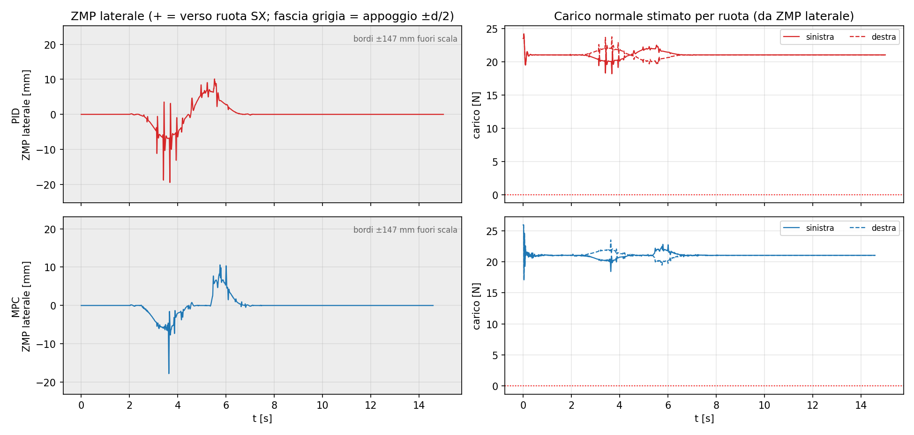
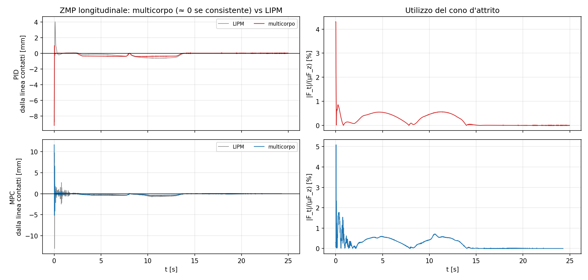
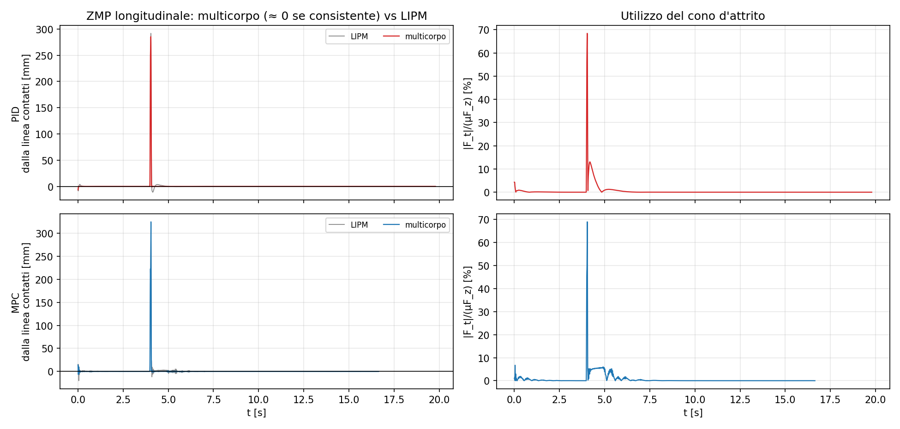
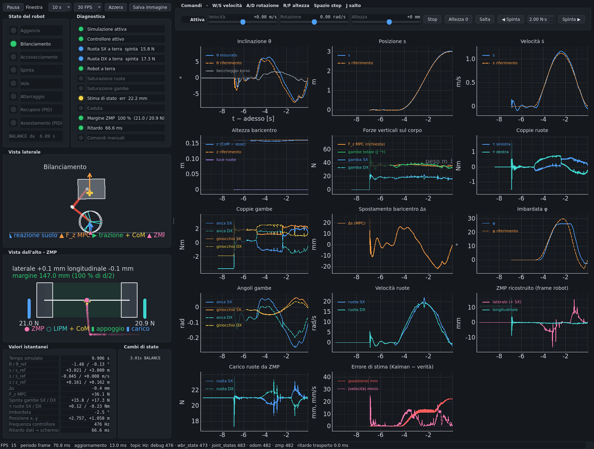

# Studio dello Zero Moment Point su RoTino

Documento sintetico, 30/09/2026. Descrive che cosa è stato aggiunto al workspace per studiare lo ZMP, perché è fatto così e che cosa dicono le prime campagne in Gazebo.

---

## 1. Obiettivo

Confrontare PID e MPC anche sul piano dell'**equilibrio al contatto**, oltre che su inclinazione e inseguimento:
- quanto lo ZMP si avvicina al bordo dell'appoggio;
- quanto carico resta sulla ruota più scarica;
- quanto è buona l'approssimazione a massa concentrata (LIPM).

Lo ZMP va reso visibile **in tempo reale** nella dashboard e **offline** nel benchmark.

## 2. Richiami

Lo ZMP è il punto del suolo in cui la risultante delle forze di contatto ha momento orizzontale nullo. Su suolo piano (z = 0), sommando su tutti i link i (massa mᵢ, CoM pᵢ, momento angolare Lᵢ attorno al proprio CoM):

```
x_zmp = [ Σ mᵢ((z̈ᵢ+g)xᵢ − ẍᵢzᵢ) − Σ L̇ᵧ,ᵢ ] / Σ mᵢ(z̈ᵢ+g)
y_zmp = [ Σ mᵢ((z̈ᵢ+g)yᵢ − ÿᵢzᵢ) + Σ L̇ₓ,ᵢ ] / Σ mᵢ(z̈ᵢ+g)
```

La forma **LIPM** considera tutto il robot come un punto nel CoM:

```
x_zmp ≈ x_com − z_com·ẍ_com/(z̈_com+g)
```

**Che cosa cambia su un robot a ruote.** I contatti sono due punti, quindi il poligono di appoggio degenera nel **segmento fra le ruote**:
- **Laterale.** Lo ZMP deve stare in [−d/2, d/2], con d = 0,294 m. Se raggiunge un estremo, la ruota opposta si scarica e il robot si ribalta di lato: è il vero margine di stabilità in curva.
- **Longitudinale.** Non c'è un'area in cui lo ZMP possa muoversi: quello vero sta per forza sulla linea dei contatti. L'equilibrio in beccheggio non si ottiene tenendo lo ZMP dentro un piede, ma **spostando il contatto** sotto il baricentro con l'accelerazione delle ruote (pendolo inverso su carrello). Il residuo longitudinale dello ZMP ricostruito serve quindi da **controllo di consistenza** della ricostruzione. Lo scarto del punto LIPM misura invece che cosa si perde trascurando momento angolare e gambe.

## 3. Perché ricostruito e non misurato

Gazebo Fortress pubblica i messaggi `Contacts` **senza `wrenches`**:
- `fn_left_N` e `fn_right_N` del logger valevano sempre 0;
- il 34,6 N di `fn_total_N` è il ripiego m_b·g del controllore, non una misura.

Le **posizioni** dei contatti ci sono, ma sono inaffidabili: campioni radi e quote anche di −3 m. Il centro di pressione (CoP) non si può quindi misurare. Lo ZMP viene ricostruito dalla formula multicorpo usando:
- la posa ground-truth della base (`/rotino/odom`, 500 Hz);
- gli angoli di giunto;
- masse e inerzie lette dall'URDF;
- i contatti ricavati per via **cinematica**, come punto più basso di ciascuna ruota.

Dallo stesso calcolo si ottengono anche:
- la **ripartizione del carico** sulle ruote, F_L = λ·F_z e F_R = (1−λ)·F_z con λ la posizione dello ZMP lungo il segmento: sostituisce le colonne di forza rotte;
- l'**utilizzo del cono d'attrito** |m·a_com,h| / (μ·F_z), con μ = 2,2 dall'URDF.

## 4. Cosa è stato implementato

| File | Contenuto |
|---|---|
| `rotino_description/zmp.py` (nuovo) | Nucleo condiviso in numpy puro (lo scipy di sistema non si carica con numpy 2.x): Savitzky–Golay, stati dei link dall'URDF, ZMP multicorpo e LIPM, contatti delle ruote, margine e carichi. `ZmpEstimator` per la dashboard (fit al centro della finestra, sui tempi reali, odom e giunti abbinati per timestamp), `zmp_series` centrato per l'analisi offline. Sta nella libreria di modello per avere **una sola copia** usata da entrambi. |
| `rotino_benchmark/logger.py` | 21 colonne in coda, quelle esistenti invariate: posa e twist della base, punti di contatto di Gazebo, **timestamp** di odom e joint_states. |
| `rotino_benchmark/zmp_analysis.py` (nuovo) | `ros2 run rotino_benchmark zmp -- <run>`: tabella di metriche per legge, 4 grafici e `zmp_<legge>.csv` per PlotJuggler. |
| `rotino_benchmark/compare.py`, `plot.py` | La tabella di confronto guadagna 3 righe ZMP; `plot` genera anche i grafici ZMP. Sui log vecchi mostra "n/d" senza rompersi. |
| `rotino_benchmark/test/test_zmp.py` (nuovo) | 10 test: derivate SG, casi analitici (statico, accelerazione laterale, L̇), frame di appoggio, robot reale fermo e in curva a raggio costante (ZMP spostato di z·a_c/g), righe di log ripetute, stimatore online con campioni persi e flussi separati. |
| `rotino_dashboard/ros_bridge.py`, `dashboard.py` | Stream `zmp` calcolato a 500 Hz nel processo ROS e **vista dall'alto animata**: impronte delle ruote, segmento e fascia di appoggio, CoM, ZMP con scia di 1,5 s, ZMP LIPM, freccia CoM→ZMP, barre del carico per ruota, margine colorato. In più: marcatore ZMP nella vista laterale, due grafici (ZMP laterale/longitudinale e carichi) e LED "Margine ZMP". |

**Bug corretto nella dashboard.** Importava `rotino_description.wbr_model`, che non esiste (il modulo è `model`). Per questo la vista laterale restava ferma su "In attesa di /robot_description" e le forze delle gambe non venivano mai calcolate.

**Due trappole risolte durante lo sviluppo:**
- **Righe a gradini.** Il logger scrive una riga per ogni `/rotino/debug` con l'*ultimo* odom e gli *ultimi* giunti ricevuti. A 1 m/s un campione di sfasamento vale 2 mm, e con due derivate a 2 ms diventa centinaia di m/s²: il primo tentativo dava uno ZMP a 15 m. Ora ogni segnale è ricampionato sul **proprio** timestamp.
- **Fase HOLD.** `jump_state` viene pubblicato solo ai cambi di fase e il logger, che parte 6 s dopo, lo perde (per il PID valeva sempre `UNKNOWN`). Il tratto con il robot agganciato si riconosce invece dalla base perfettamente ferma.

Nei campioni con F_z < 20 % di m·g (ruote quasi scariche) lo ZMP non è definito: vengono esclusi dalle metriche e contati a parte.

### Comandi

```bash
colcon build --symlink-install && source install/setup.zsh
ros2 run rotino_benchmark campaign -- curva_S                 # PID e MPC, poi confronto.md e grafici (anche ZMP)
ros2 run rotino_benchmark zmp -- <cartella dello scenario>    # solo la tabella e i grafici ZMP
ros2 run rotino_benchmark suite                               # tutti gli scenari
ros2 launch rotino_mpc rotino_mpc.launch.py dashboard:=true   # ZMP animato dal vivo
cd src/rotino_benchmark && python3 -m pytest -q test          # test
```

## 5. Risultati

Gazebo headless, 500 Hz, stesso mondo e URDF per le due leggi. Le campagne del 30/09 sono in `benchmark_runs/archivio_2026-09-30_01/` (non versionato). Il 01/10 lo SMC è stato tolto dal progetto e il PID riprogettato: le figure qui sotto vengono dalla suite PID–MPC del 01/10 (`benchmark_runs/suite_pid_mpc/`), la colonna "PID 30/09" dal controllore precedente.

| Campagna | Argomenti | Durata |
|---|---|---|
| `zmp_planar` | `planar_enable:=true` (S di 3 m, scarto laterale 0,6 m in 12 s) | 25 s |
| `zmp_planar_fast` | come sopra con `traj_duration:=5.0 traj_lateral:=1.0` | 15 s |
| `zmp_push` | `push_enable:=true` (2,7 N·s sul torso) | 20 s |
| `zmp_velocity` | `velocity_enable:=true velocity_max:=1.0` | 20 s |

**Curva a S veloce**, la campagna che sollecita di più il margine laterale:

| metrica | PID 30/09 | PID-ZMP (01/10) | MPC (01/10) |
|---|---|---|---|
| ZMP laterale max / (d/2) | 139 % | 13,2 % | **12,1 %** |
| margine laterale minimo | −57 mm | 127,6 mm | **129,3 mm** |
| carico minimo sulla ruota più scarica | 0 N | **18,2 N** | 17,1 N |
| residuo longitudinale rms | 17,7 mm | 0,29 mm | 0,53 mm |

Il 30/09 l'MPC aveva usato il 16 % del semi-appoggio nella stessa prova: la differenza fra due esecuzioni dà l'ordine della variabilità da prova a prova.
| \|ZMP multicorpo − LIPM\| rms | 56 mm | 0,74 mm | 2,4 mm |
| utilizzo d'attrito max | 42 % | 6,5 % | 7,9 % |
| tempo con F_z < 20 % m·g | 8,0 % | 0 % | 0 % |



**Che cosa dicono i numeri:**

1. **La ricostruzione è consistente.** Con MPC e PID-ZMP il residuo longitudinale resta sotto 1 mm rms in tutte le campagne senza spinte. È ciò che la fisica impone a due contatti puntiformi, e lo ZMP multicorpo non lo "sa" a priori. Tre verifiche indipendenti lo confermano:
   - i contatti cinematici distano 0,1–7 mm da quelli di Gazebo, quando questi sono validi;
   - sugli assi y e z l'accelerazione ricostruita della base coincide con l'IMU (0,01–0,02 m/s² rms);
   - lo stimatore online e l'analisi offline differiscono di 0,2–0,4 mm.
2. **In curva lo ZMP si sposta verso la ruota esterna, come previsto** (z·a_c/g). Nella S veloce MPC e PID-ZMP usano il 12–13 % del semi-appoggio e restano lontani dal ribaltamento, con almeno 17 N sulla ruota scarica. Con la S lenta lo ZMP laterale non supera il 3 %.
3. **Lo ZMP longitudinale segue le fasi di accelerazione** per entrambe le leggi, senza oscillazioni ad alta frequenza.

   
4. *(Aggiornamento 01/10: il PID è stato riprogettato con lo ZMP come variabile di controllo e ora rispetta il criterio in tutte le campagne; nelle campagne "spinta" e "trapezio" di questo documento il PID non eseguiva ancora lo scenario. Vedi `PID_ZMP.md`.)* **Il PID non rispetta il criterio ZMP.** Lo ZMP laterale esce dal segmento di appoggio (fino al 143 %) e le ruote si scaricano per l'8–19 % del tempo. Non è un artefatto: anche l'IMU misura un'accelerazione dinamica mediana di 9,8 m/s². È il ciclo limite bang-bang delle gambe descritto in `diagnostics/06_diagnosi.txt`, visto questa volta dal lato del contatto.
5. **Il residuo longitudinale funziona da rilevatore di forze esterne.** Nella spinta vale circa 0 per tutta la prova tranne un picco di 270–340 mm **esattamente all'istante dell'impulso**. La formula assume che le sole forze esterne siano la gravità e la reazione del suolo: la forza sul torso compare come uno spostamento apparente dello ZMP. Nello stesso istante anche l'utilizzo d'attrito risulta gonfiato (58–69 %).

   
6. **Il modello LIPM basta per l'MPC e per il PID-ZMP** (sotto 1 mm di differenza dallo ZMP multicorpo), ma non bastava per il PID del 30/09 (35–56 mm), dove le gambe vibravano e il momento angolare pesava.

**La dashboard dal vivo** (MPC, S veloce). A sinistra la vista dall'alto con lo ZMP; nella griglia, in basso a destra, i grafici "ZMP ricostruito" e "Carico ruote da ZMP". Lo stream `zmp` gira a circa 480 Hz, come odom, con circa 260 µs di calcolo per campione nel processo ROS della dashboard.



**Due trappole della versione online, risolte:**
- **Rumore della derivata.** Valutare la derivata seconda all'estremo della finestra dava ±200 mm di rumore: ora il fit è valutato al centro, con un ritardo di 25 ms.
- **Campioni mancanti.** Odom perde circa il 10 % dei campioni (arriva a 484 Hz) e i pesi Savitzky–Golay uniformi mettevano i punti dopo un buco nell'istante sbagliato, con 34 mm di deviazione standard. Ora il fit usa i tempi reali. Odom e giunti vengono inoltre abbinati per timestamp.

**Bug di pyqtgraph evitato.** `PlotWidget` copia sull'istanza il metodo `clear` del `PlotItem`, che rimuove tutti gli elementi. Un metodo `clear()` definito nella vista veniva quindi scavalcato e la vista restava vuota: per questo si chiama `reset_view()`.

## 6. Limiti e sviluppi

- **È una ricostruzione, non una misura.** Dipende dal modello di massa dell'URDF e dal filtro, con una finestra SG di 40 ms. Lo stimatore della dashboard è causale e mostra lo ZMP con circa 25 ms di ritardo.
- **La ripartizione dei carichi è statica.** Deriva dallo ZMP laterale e ignora le forze interne fra le ruote. Va bene per capire quando una ruota si scarica, meno per valori assoluti durante gli urti.
- **Il suolo è assunto piano a z = 0**, come nel mondo di simulazione. Con pendenze bisogna proiettare sul piano locale.
- **Sviluppi:**
  - usare il margine laterale come **vincolo** nell'MPC (limite su velocità e raggio di curva, oppure inclinazione in curva con le gambe, come fa Ascento);
  - riattivare le forze di contatto se si passa a Gazebo Harmonic, per confrontare CoP misurato e ZMP ricostruito.
